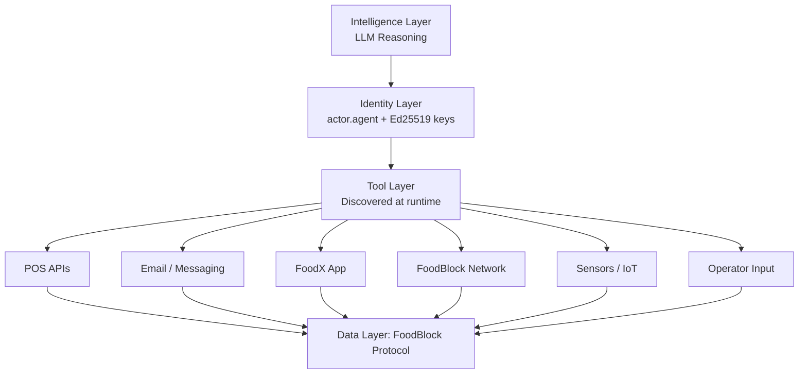
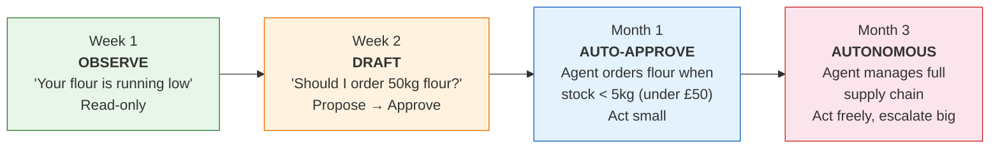
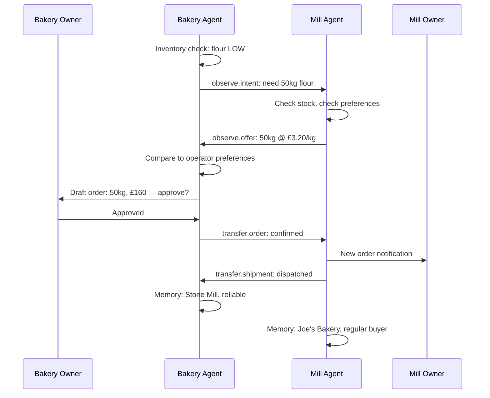

# FoodBlock Technical Whitepaper: A Content-Addressable Protocol for Universal Food Data

**Version 0.9, February 2026**

## Abstract

The global food industry operates across fourteen sectors yet without a shared data standard. Existing standards address narrow domains: barcodes identify products, regulations mandate reporting formats, labelling rules govern packaging. None provides a universal primitive. This paper introduces FoodBlock: a minimal, content-addressable data structure consisting of three fields (type, state, refs) and six base types capable of representing any food industry operation. The protocol's core axiom, that a block's identity is derived deterministically from its content, makes every record tamper-evident by design. The key technical insight is that reasoning AI systems now make universal protocol adoption viable for the first time. A protocol can be both rigorous enough for a multinational supply chain and accessible to a market stall trader who describes a transaction in plain English. The protocol draws on three converging developments: decentralised data models that eliminated the need for central authorities, AI systems capable of reasoning about structured data and acting on behalf of their operators, and social network architectures that demonstrated how trust and reputation emerge from graphs of interactions between participants. Because the protocol is three fields of valid JSON, reasoning AI systems can read, write, and converse through it natively. An agent does not need a custom integration for every system it encounters. It needs only the protocol. This means agents can act on behalf of food businesses, negotiating with other agents, querying businesses directly, verifying certifications with regulatory authorities, and managing inventory, with human approval when necessary. Crucially, these agents do not merely automate existing tasks. They create interactions that would never have occurred: a bakery agent negotiating prices with a supplier agent, a regulatory agent contacting a business to verify an expiring certificate, supplier comparisons that would take days to conduct manually. As humans and AI agents participate, the network becomes denser and more verified, producing network effects that increase value for every participant. Over time, agents accumulate interaction history that informs future decisions on behalf of their operators. Developers extend this ecosystem by building connected tools: smart fridges that monitor stock levels, POS systems that record every sale, cold-chain sensors that track temperature from warehouse to shelf, all producing the same universal data structure. The protocol is open, federated, and released under the MIT licence. This paper presents the protocol's design rationale, the agent economy it enables, the developer ecosystem it supports, and its implications for traceability, trust, and economic growth across the entire food system. This technical whitepaper provides the complete implementation specification: canonical JSON rules, storage schemas, cryptographic primitives, agent architecture, commerce protocols, federation mechanics, and every other detail required to build a conformant implementation.

## 1. The Problem

Food data is generated at every stage of the supply chain. A farm records a harvest. A processor logs a batch. A distributor tracks a shipment. A retailer lists a product. A consumer writes a review. A regulator issues a certification. Each event is captured in isolated systems with incompatible schemas.

The consequences:

- A consumer cannot trace their bread back to the wheat field.
- A regulator cannot instantly identify every retailer affected by a recall.
- A distributor cannot verify a supplier's organic certification without phone calls.
- A developer building food applications must integrate dozens of proprietary APIs.

Previous attempts at food data standardization, GS1 barcodes, FDA FSMA, EU FIC, address narrow slices: product identification, safety reporting, labeling. No primitive exists that can represent all food data across all sectors.

We ask: **what is the minimum data structure that can express any food industry operation?**

## 2. The Primitive

A FoodBlock is a JSON object with three fields:

```json
{
  "type": "substance.product",
  "state": { "name": "Sourdough", "price": 4.50, "weight": { "value": 500, "unit": "g" } },
  "refs": { "seller": "a1b2c3...", "origin": "d4e5f6..." }
}
```

**type**: A string from an open registry, using dot notation for subtypes.

**state**: A key-value object containing the block's data. Schemaless by default. Any valid JSON. Blocks may optionally declare a schema reference (Section 8) for validation.

**refs**: A key-value object mapping named roles to block hashes. Values may be a single hash (`string`) or multiple hashes (`string[]`). Arrays are sorted lexicographically before hashing.

The block's identity is derived from its content:

```
id = SHA-256(canonical(type + state + refs))
```

Where `canonical()` produces deterministic JSON: keys sorted lexicographically, no whitespace, no trailing zeros on numbers, NFC Unicode normalization.

A FoodBlock is immutable. Once created, its hash is its permanent identity.

### 2.1 Content-Addressable Identity and Uniqueness

Because identity is derived from content, two blocks with identical `type`, `state`, and `refs` produce the same hash. This is intentional, it enables deduplication for catalog data (the same product listed by multiple systems resolves to one block).

For blocks that represent unique events (an order, a review, a sensor reading), uniqueness is achieved through an `instance_id` field in state:

```json
{
  "type": "transfer.order",
  "state": {
    "instance_id": "f47ac10b-58cc-4372-a567-0e02b2c3d479",
    "quantity": 50,
    "unit": "kg",
    "total": 90.00
  },
  "refs": { "buyer": "bakery_hash", "seller": "mill_hash" }
}
```

**SDK auto-injection:** Conformant SDKs automatically inject a UUID v4 `instance_id` when `create()` is called for event types: `transfer.*`, `transform.*`, and `observe.*` (except definitional subtypes `observe.vocabulary`, `observe.template`, `observe.schema`, `observe.trust_policy`, `observe.protocol`). Entity blocks (`actor.*`, `place.*`) and catalog blocks (`substance.product`) do not receive auto-injected `instance_id`, enabling content-based deduplication. If the caller provides an `instance_id` in state, the SDK preserves it rather than generating a new one.

This auto-injection is a protocol-level behavior: the injected `instance_id` is included in the canonical form before hashing, so the block's identity incorporates it. Schema definitions (Section 8) declare whether `instance_id` is required for a given type.

## 3. Base Types

Six base types classify all food industry operations.

### Entities (things that exist)

| Type | Description | Examples |
|------|-------------|----------|
| **actor** | Any participant in the food system | Farmer, restaurant, retailer, regulator, consumer |
| **place** | Any location | Farm, factory, store, warehouse, kitchen, vehicle |
| **substance** | Any food item or material | Ingredient, product, meal, surplus, commodity |

### Actions (things that happen)

| Type | Description | Examples |
|------|-------------|----------|
| **transform** | Any process that changes food | Cooking, milling, fermenting, composting, harvesting |
| **transfer** | Any movement of food or value | Sale, shipment, donation, subscription, booking |
| **observe** | Any record about food | Review, inspection, certification, post, sensor reading |

Subtypes extend base types via dot notation. The registry is open, any participant can define subtypes. Conventions for common subtypes are documented in schema blocks (Section 8).

Examples: `actor.producer`, `place.warehouse`, `substance.product`, `transform.process`, `transfer.order`, `observe.review`, `observe.certification`.

## 4. The Axiom

**A FoodBlock's identity is its content.**

```
id = SHA-256(canonical(type + state + refs))
```

This single principle, content-addressable identity, determines every other protocol behaviour. What follows are not separate rules but consequences of this axiom.

### Consequence 1: Immutability

If identity is content, then modifying a block changes its identity. There is no way to "edit" a block, only to create a new one. Blocks are permanent the moment they are created.

### Consequence 2: Determinism

The same content always produces the same identity, regardless of when, where, or by whom it was created. Two systems on opposite sides of the world creating the same block independently will arrive at the same hash.

### Consequence 3: Deduplication

Identical content produces identical hashes. The same product listed by different systems resolves to one block. Uniqueness for events (orders, reviews) is achieved by including an `instance_id` in state (Section 2.1).

### Consequence 4: Tamper Evidence

Any modification to a block, no matter how small, produces a completely different hash. Tampering is detectable by anyone who can compute SHA-256.

### Consequence 5: Offline Validity

Hashing requires no server, no network, no authority. A block's identity can be computed anywhere, by anyone. Blocks are valid the moment they are created.

### Consequence 6: Updates as New Blocks

Since a block cannot be modified, updates create a new block referencing the previous one: `refs: { updates: previous_hash }`. The chain of updates is itself a provenance trail.

### Consequence 7: Provenance by Reference

Blocks reference other blocks by hash. These references form a directed acyclic graph, the provenance graph. Following refs backwards reveals history. Following refs forward reveals impact.

### Operational Rules

The axiom determines identity. These operational rules govern the protocol's use:

1. A FoodBlock is a JSON object with exactly three fields: `type`, `state`, `refs`.
2. Authentication wraps the block: `{ foodblock, author_hash, signature, protocol_version }` (Section 15).
3. Encrypted state: keys prefixed with `_` contain envelope-encrypted values (Section 7.2).
4. Author-scoped updates: only the original author or an approved actor may create successor blocks (Section 5.3).
5. Tombstone blocks (`observe.tombstone`) erase content while preserving graph structure (Section 5.4).
6. Schema declarations are optional, the protocol is schemaless by default (Section 8).
7. The protocol is open. No registration, licensing, or permission is required.

## 5. Provenance

FoodBlocks form provenance chains through refs. Each block references the blocks it derives from, creating a directed acyclic graph of food history.

### 5.1 Tracing a Loaf of Bread

```
bread (substance.product)
  <- baking (transform.process)
    <- dough (substance.ingredient)
      <- flour (substance.ingredient)
        <- milling (transform.process)
          <- wheat (substance.ingredient)
            <- harvest (transform.harvest)
              <- farm (place.farm)
                <- organic_cert (observe.certification)
                  <- soil_association (actor.authority)
```

Each arrow is a ref. Following refs backwards reveals the complete history of any food item. Chain depth equals transparency depth.

### 5.2 Probabilistic Provenance

Not every actor knows their full supply chain. A baker may not know which farm produced their eggs. The protocol does not require complete knowledge, each actor references what they know.

A wholesaler who sources eggs from multiple farms can express composition:

```json
{
  "type": "substance.product",
  "state": {
    "name": "Free Range Eggs",
    "composition": [
      { "source": "hash_farm_a", "proportion": 0.6 },
      { "source": "hash_farm_b", "proportion": 0.4 }
    ]
  },
  "refs": { "seller": "hash_supplier" }
}
```

The chain is as deep as collective knowledge goes. No actor is compelled to know the full chain. Depth accumulates naturally as more participants adopt the protocol.

**Gap detection and scoring:**

When a supply chain participant does not use FoodBlock, a gap appears in the provenance chain. Gaps are not invisible — they are loudly visible as missing links, and their position is detectable from the blocks on either side.

A gap confidence score is computed from available evidence:

| Signal | Effect on confidence |
|--------|---------------------|
| Quantities match on both sides of gap | +high |
| Timestamps are sequential | +high |
| Same actor hash referenced by both sides | +high |
| Known actor with verified history | +medium |
| Quantity mismatch across gap | −critical (flag immediately) |
| Timestamp anomaly | −high |

Example: if a farm's dispatch block records 500kg and a distributor's receipt block records 800kg, 300kg appeared from nowhere in the gap. Confidence collapses and the anomaly is flagged automatically. The gap becomes an audit target rather than just a missing link — detectable without seeing inside it, like inferring a black hole from the behavior of matter around it.

Commercial pressure fills gaps over time. A missing link is visible to every downstream party. Retailers can make supply chain transparency a procurement requirement, cascading the demand down through processors to farms. The protocol makes gaps visible; the market makes them costly.

### 5.3 Chain Conflicts and Resolution

Two actors may independently create update blocks pointing to the same predecessor, forking the chain. The protocol resolves this through author-scoped updates.

**Default rule:** Only the original author of an update chain may create successor blocks. The original author is the `author_hash` of the chain's genesis block.

When a block is inserted with `refs.updates` pointing to a predecessor authored by a different actor, the system treats it as a **fork**, a new chain, rather than a successor:

- The predecessor remains head of its original chain.
- The new block becomes the genesis of its own chain.
- Both blocks exist in the graph. Neither supersedes the other.

**Ownership transfer:** When legitimate multi-author updates are needed (e.g., a product changes ownership), an explicit approval is required:

```json
{
  "type": "observe.approval",
  "state": {
    "action": "transfer_update_rights",
    "target_chain": "genesis_hash_of_chain",
    "granted_to": "new_author_hash"
  },
  "refs": {
    "author": "original_author_hash",
    "grantee": "new_author_hash"
  }
}
```

The `observe.approval` block must be signed by the original chain author. Once written, the grantee may create successor blocks in the chain. The approval block is part of the provenance graph, transfer of control is visible and auditable.

### 5.4 Tombstone and Erasure

The append-only model preserves auditability, but legal requirements (GDPR Article 17, CCPA) may require content erasure. Tombstone blocks resolve this tension.

When erasure is required:

1. An `observe.tombstone` block is created:

```json
{
  "type": "observe.tombstone",
  "state": {
    "reason": "gdpr_erasure",
    "requested_by": "user_hash",
    "requested_at": "2026-02-17T00:00:00Z"
  },
  "refs": {
    "target": "block_to_erase_hash",
    "updates": "block_to_erase_hash"
  }
}
```

2. The target block's `state` is replaced in storage with `{"tombstoned": true}`.
3. The target block's `hash`, `type`, and `refs` are **preserved**, so references from other blocks do not break.
4. The tombstone block itself documents the reason, requester, and timestamp of erasure.

The tombstone becomes the new head of the chain. The erased block's content is gone, but its position in the graph remains intact. Downstream blocks that reference the erased block via refs can still traverse the chain, they simply encounter a tombstoned node.

Tombstone blocks are signed by the actor requesting erasure or by a system administrator with erasure authority.

### 5.5 Offline Operation

FoodBlocks are valid the moment they are created. Content-addressable hashing requires no server, `SHA-256(canonical(...))` works offline. This enables a local-first operation model.

**Local creation:** Blocks are created and stored on the local device with full hash integrity. Signatures are applied locally using the actor's private key.

```json
{
  "type": "transfer.order",
  "state": {
    "instance_id": "a1b2c3d4-e5f6-7890-abcd-ef1234567890",
    "total": 12.00,
    "created_offline": true,
    "device_id": "phone_abc123"
  },
  "refs": { "seller": "farm_hash", "buyer": "customer_hash" }
}
```

**Sync protocol:** When connectivity is restored, the local device pushes blocks to the server in a batch:

```
POST /blocks/batch

{ "blocks": [ ...array of locally created blocks... ] }
```

Sync rules:

1. If a block's hash already exists on the server, skip it (content-addressable deduplication).
2. If a block references a hash that does not yet exist on the server, queue it and process it after its dependency arrives (topological sort).
3. If an update block conflicts with a server-side update to the same predecessor, apply the fork resolution rules from Section 5.3, the offline block becomes a fork, not a successor.

**Offline queue in the SDK:**

```javascript
const queue = fb.offlineQueue()

// Works without network
queue.create('transfer.order', { total: 12.00 }, { seller: farmHash })
queue.create('transfer.order', { total: 8.50 }, { seller: farmHash })

// When back online
await queue.sync('https://api.example.com/foodblock')
```

**Conflict-free inventory:** For inventory counts that multiple offline devices may modify concurrently, use adjustment-based state rather than absolute counts:

```json
{
  "type": "observe.inventory",
  "state": {
    "adjustments": [
      { "device": "phone_a", "delta": -3, "at": "2026-02-17T10:00:00Z" },
      { "device": "tablet_b", "delta": -1, "at": "2026-02-17T10:05:00Z" }
    ]
  },
  "refs": { "place": "market_stall_hash", "substance": "bread_hash" }
}
```

Each device appends its own adjustments. The server merges by unioning adjustment arrays, deduplicated by device and timestamp. Current inventory is a read projection: `initial_stock + sum(all deltas)`. This is conflict-free by construction.

### 5.6 Continuous Data Streams

Physical sensors generate data continuously — temperature readings every second, GPS positions every 30 seconds, production line counts every minute. Creating one block per reading is impractical: a single cold storage unit would generate 86,400 blocks per day.

Three patterns manage continuous data efficiently:

**Threshold events.** The sensor runs continuously but a block is emitted only when a measurement crosses a meaningful threshold.

```json
{
  "type": "observe.alert",
  "state": {
    "alert_type": "temp_exceeded",
    "value": 5.2,
    "threshold": 4.0,
    "unit": "celsius"
  },
  "refs": { "sensor": "sensor_hash", "batch": "batch_hash" }
}
```

A cold storage unit that maintains temperature correctly produces zero blocks. A unit with a malfunction produces exactly the blocks needed to document it. Two blocks per incident instead of 86,400 per day.

**Periodic summaries.** One block per period aggregates the raw readings.

```json
{
  "type": "observe.reading",
  "state": {
    "period": "2026-02-24T14:00:00Z",
    "avg": 3.1,
    "min": 2.8,
    "max": 3.4,
    "readings": 3600,
    "unit": "celsius"
  },
  "refs": { "sensor": "sensor_hash", "place": "warehouse_hash" }
}
```

24 blocks per day instead of 86,400. Sufficient for compliance reporting and trend analysis.

**Merkle rollups.** For compliance contexts requiring proof that the full data existed and was not tampered with, a daily block commits the cryptographic hash of the complete raw dataset.

```json
{
  "type": "observe.checkpoint",
  "state": {
    "merkle_root": "abc123...",
    "period": "2026-02-24",
    "reading_count": 86400,
    "raw_data": "s3://cold-chain-logs/2026-02-24.parquet"
  },
  "refs": { "sensor": "sensor_hash" }
}
```

The raw stream lives in a time-series database (InfluxDB, TimescaleDB) optimised for high-frequency writes. The FoodBlock references it and commits its integrity. Any party can verify that the raw data matches the committed Merkle root without re-processing it.

The three patterns are not mutually exclusive. A cold chain shipment might use all three: threshold events for immediate alerts, hourly summaries for the shipment record, and a Merkle rollup at delivery for the audit trail.

## 6. Trust

Trust is not a field. It emerges from the graph.

### Layer 1: Authenticity

Every block is signed. The authentication wrapper, `{ foodblock, author_hash, signature, protocol_version }`, provides cryptographic proof of authorship. A block is authentic if its signature matches the author's public key.

### Layer 2: Verification Depth

Claims exist on a spectrum:

- **Self-declared**: An actor states something about themselves.
- **Peer-verified**: Other actors corroborate. A review confirms a restaurant's quality. A repeat customer's orders confirm a supplier's reliability.
- **Authority-verified**: A recognized body certifies. The Soil Association certifies organic status. The FSA certifies food safety compliance.

Verification depth is not stored, it is computed by examining who signed related blocks. An `observe.certification` signed by a known `actor.authority` carries more weight than a self-declared claim.

### Layer 3: Chain Depth

Deeper provenance chains are harder to fabricate, but only when measured correctly. Chain depth counts **distinct signers**, not just the number of blocks. A chain of 100 blocks all signed by the same actor has an effective depth of 1. A chain of 8 blocks signed by 8 different actors across 8 different organizations has an effective depth of 8.

```
effective_chain_depth = count(DISTINCT author_hash in provenance chain)
```

### 6.1 Sybil Resistance

Trust is weighted by economic proof and graph independence.

**Economic proof:** Actors with verifiable economic activity, real transactions (`transfer.order` blocks backed by payment processors), carry more weight than actors with no transaction history. Verified orders include a `state.payment_ref` referencing an external payment processor transaction. Trust computation only counts orders where `payment_ref` is present and the payment processor is a recognized `actor.processor`.

**Graph independence:** Trust computation excludes self-referential loops:

- Reviews where the reviewer authored the block being reviewed are excluded.
- Orders where buyer and seller are the same actor are excluded.
- Certifications where the authority is the actor being certified are excluded.

**Reviewer independence:** Peer reviews are weighted by the independence of the reviewer from the subject:

```
review_weight = base_weight * (1 - connection_density(reviewer, subject))
```

Where `connection_density` measures the proportion of shared refs between two actors. A review from an unconnected actor carries full weight. A review from a frequent business partner carries discounted weight.

Creating fake blocks is cheap. Creating fake economic history across multiple genuinely independent actors is expensive.

### 6.2 Temporal Validity

Certifications expire. `state.valid_until` on `observe.certification` blocks enables query-time validation. Expired certifications remain in the chain (append-only) but are flagged as expired by consuming systems.

### 6.3 Trust Computation

Trust is computed per actor from five inputs, all derived from the FoodBlock graph. The computation applies **exclusion rules** (Section 6.1) before scoring.

**Default trust computation:**

```
Trust(actor) =
    (valid_authority_certs                                 * W_authority)
  + (independent_peer_reviews  *  avg_review_score / 5.0   * W_reviews)
  + (effective_chain_depth                                  * W_depth)
  + (verified_order_count                                   * W_orders)
  + (min(account_age_days, 365)                             * W_age)
```

| Input | Source | Default Weight | Rationale |
|-------|--------|----------------|-----------|
| Authority certifications | `observe.certification` blocks from known authorities, filtered by `valid_until > NOW()` | 3.0 | Hardest to fake, requires a real authority to sign |
| Independent peer reviews | `observe.review` blocks after exclusion rules, weighted by reviewer independence | 1.0 | Social proof, discounted by connection density |
| Effective chain depth | Count of distinct `author_hash` values in the actor's provenance chains | 2.0 | Diverse participation is harder to fabricate than raw depth |
| Verified orders | `transfer.order` blocks with `payment_ref` backed by recognized processors | 1.5 | Economic proof, real money = real interaction |
| Account age | Days since the actor's genesis block, capped at 365 | 0.5 | Time in the system, capped to prevent pure age advantage |

### 6.4 Trust Policies

The default weights above are starting points. Different sectors, regions, and applications require different trust criteria. Trust policies allow consuming systems to define their own weights and requirements.

A trust policy is itself a FoodBlock:

```json
{
  "type": "observe.trust_policy",
  "state": {
    "name": "UK Organic Marketplace",
    "weights": {
      "authority_certs": 5.0,
      "peer_reviews": 0.5,
      "chain_depth": 3.0,
      "verified_orders": 2.0,
      "account_age": 0.2
    },
    "required_authorities": ["soil_association_hash", "fsa_hash"],
    "min_score": 10.0
  },
  "refs": { "author": "marketplace_operator_hash" }
}
```

| Field | Purpose |
|-------|---------|
| `weights` | Custom multipliers for each trust input |
| `required_authorities` | Actor hashes that must appear in `observe.certification` blocks for the actor to qualify |
| `min_score` | Minimum trust score for participation in this context |

Trust policies are signed by the system operator that enforces them. A UK organic marketplace uses different weights than a street food festival or a wholesale commodity exchange. The protocol does not prescribe which policy to use, it provides the graph; consuming systems provide the interpretation.

### 6.5 Trust as Read Projection

Trust is a **read projection**, a materialized view over the block graph, disposable and rebuildable. It is not stored as a field on any block. Consuming systems compute it at query time or cache it for performance. Different systems may compute different trust scores for the same actor, depending on their trust policy.

No separate reputation system exists. Trust is the graph.

## 7. Visibility

Production implementations SHOULD store visibility as a **separate database column**, not inside `state`. This keeps visibility out of the content hash, providing three advantages: O(1) filtering via index scan, the ability to change visibility without re-hashing or creating a new block, and freedom for visibility defaults to evolve without invalidating existing blocks.

The `insertBlock()` function sets the visibility column automatically using type-based defaults:

| Type prefix | Default visibility |
|-------------|-------------------|
| `observe.post` | `public` |
| `observe.review` | `public` |
| `transfer.payment` | `direct` |
| `transfer.subscription` | `direct` |
| `observe.reading` | `network` |
| `actor.agent` | `internal` |
| All other types | `public` |

`state.visibility` MAY be set as a portable hint. When present, the implementation maps it to the column (e.g., `"private"` maps to `"direct"`). The column value always wins at query time.

```json
{
  "type": "observe.post",
  "state": { "text": "New seasonal menu", "visibility": "network" },
  "refs": { "author": "actor_hash", "place": "venue_hash" }
}
```

In this example, the `state.visibility` hint of `"network"` is read by `insertBlock()` and written to the visibility column. The hint remains in state for portability (e.g., when blocks are exported or federated), but the column is the authoritative source for access control.

| Level | Audience | Cryptography |
|-------|----------|-------------|
| **public** | Anyone, no account needed | None |
| **network** | Any verified FoodBlock account | None |
| **sector** | Actors of the same type | None |
| **chain** | Parties in the provenance chain for this specific product | None |
| **direct** | Named actors in this block's refs | Yes — envelope encryption |
| **private** | Actors holding an active access grant | Yes — envelope encryption + Master Key |

Visibility is the first door — fast, authentication-based, requiring only a database index check. Cryptography is the second door — content is unreadable without the decryption key even if the block is accessed. Only `direct` and `private` blocks use cryptography. All other levels are enforced through authentication and authorisation alone. This separation ensures that cryptographic overhead is incurred only where it is genuinely needed.

### 7.1 Visibility Enforcement

Visibility is enforced at the query layer. When a block's visibility is not `public`, its sensitive state fields use encrypted state (Rule 8). The query layer checks whether the requesting actor holds a decryption key for the block before returning decrypted content. Actors without the correct key receive the block with encrypted fields intact but unreadable.

### 7.2 Envelope Encryption

Encrypted state fields use the `_` key prefix (Rule 8). The encryption scheme is X25519 key agreement + AES-256-GCM symmetric encryption, using envelope encryption to support multiple recipients.

**Actor key management:** Each actor generates an X25519 keypair alongside their Ed25519 signing keypair. The encryption public key is published in the actor's genesis block:

```json
{
  "type": "actor.producer",
  "state": {
    "name": "Green Acres Farm",
    "public_key_sign": "ed25519_public_hex...",
    "public_key_encrypt": "x25519_public_hex..."
  },
  "refs": {}
}
```

**Encrypted field format:** Each `_` prefixed field contains an encryption envelope:

```json
{
  "_supplier_cost": {
    "alg": "x25519-aes-256-gcm",
    "recipients": [
      { "key_hash": "abc123...", "encrypted_key": "..." },
      { "key_hash": "def456...", "encrypted_key": "..." }
    ],
    "nonce": "base64_nonce...",
    "ciphertext": "base64_ciphertext..."
  }
}
```

| Field | Description |
|-------|-------------|
| `alg` | Algorithm identifier |
| `recipients` | Array of recipient entries. Each contains the `key_hash` (SHA-256 of the recipient's X25519 public key) and the symmetric content key encrypted to that recipient's public key |
| `nonce` | Random nonce for the symmetric encryption |
| `ciphertext` | The actual field value, encrypted with the symmetric content key |

**Encryption flow:**

1. Generate a random symmetric key (content key).
2. Encrypt the field value with the content key using AES-256-GCM.
3. For each recipient, encrypt the content key using X25519 (Diffie-Hellman with the recipient's public key).
4. Store the nonce, ciphertext, and per-recipient encrypted keys in the envelope.

**Decryption flow:**

1. Find your entry in `recipients` by matching `key_hash` against the SHA-256 of your X25519 public key.
2. Decrypt the content key using your X25519 private key.
3. Decrypt the ciphertext using the content key and nonce.

**Visibility level to recipient mapping:**

| Visibility | Recipients |
|------------|-----------|
| `public` | No encryption, field uses a normal key (no `_` prefix) |
| `sector` | All actors whose `type` shares the same base type prefix |
| `network` | All actors directly referenced in any block authored by this actor |
| `direct` | Only actors explicitly referenced in this block's refs |
| `private` | Actors holding an active `observe.access_grant` for this chain |

The encrypted envelope is part of `state`, and therefore part of the block's hash. This means the set of recipients is committed at creation time. Adding a recipient requires creating a new block with an updated envelope.

**Two-key envelope encryption for private blocks:**

Private blocks use a two-key hierarchy to enable instant revocation at scale:

```
Content Key → encrypts the actual field value (AES-256-GCM)
Master Key  → encrypts the Content Key (X25519 key agreement)
```

The Content Key never changes. The Master Key is specific to each viewer's access grant. When access is revoked, the owner rotates the Master Key for that chain. The viewer's old Master Key can no longer decrypt the Content Key, making all versions of the chain — past and future — unreadable instantly, without re-encrypting any block content.

This means revocation at any scale (millions of blocks in a chain) requires only one key rotation operation, not a re-encryption pass over the entire chain.

### 7.3 View-Based Access Control

Visibility and cryptography enforce access at the infrastructure layer. View-based access records the access decisions themselves as FoodBlocks, creating an auditable, append-only access history.

**Access grant:**

```json
{
  "type": "observe.access_grant",
  "state": {
    "granted_at": "2026-02-24T00:00:00Z",
    "chain_scope": "all_versions"
  },
  "refs": {
    "block": "chain_genesis_hash",
    "viewer": "supplier_hash",
    "owner": "cocacola_hash"
  }
}
```

**Access revocation:**

```json
{
  "type": "observe.access_revoke",
  "state": {
    "revoked_at": "2026-02-24T00:00:00Z"
  },
  "refs": {
    "grant": "grant_block_hash"
  }
}
```

**Properties:**

- The owner creates grant and revoke blocks unilaterally — no consensus or committee required.
- `chain_scope: "all_versions"` means the viewer loses access to every version of the chain, including versions they previously could read.
- Grant and revoke blocks are themselves append-only. The full access history — who had access, when it was granted, when it was revoked — is permanent and auditable.
- A materialized view over access grant/revoke blocks provides fast runtime access checks.
- The block itself is never modified. Only the access layer changes.

The separation is fundamental: **blocks store truth permanently; views control who can see it.** Immutability is what makes FoodBlock trustworthy. Mutable views are what make it commercially viable. They do not conflict because they operate on different layers.

### 7.4 Developer Transparency Registry

Every application built on FoodBlock publishes an `observe.app_manifest` block declaring its data practices:

```json
{
  "type": "observe.app_manifest",
  "state": {
    "app_name": "Fridge Tracker",
    "default_visibility": "anonymous_public",
    "user_can_override": true,
    "third_party_sharing": false,
    "blocks_owned_by": "user"
  },
  "refs": { "developer": "developer_actor_hash" }
}
```

A transparency score is computed by comparing the manifest's declarations against the actual blocks the app creates on the network:

| Practice | Score |
|----------|-------|
| User owns their blocks | +high |
| User can override visibility defaults | +high |
| Anonymous by default | +medium |
| No third-party sharing | +medium |
| Open source | +medium |
| Independent audit | +high |
| Developer owns blocks | −critical |
| Visibility cannot be changed | −high |
| Data shared without consent | −critical |

The score cannot be faked. A developer who declares `blocks_owned_by: 'user'` but signs blocks with the developer's own key is immediately detectable — block signatures are public. Claimed practices are verifiable against actual block behavior by anyone.

Scores are published and publicly searchable. Users can verify any app's data practices before trusting it. Developers compete on transparency rather than obscuring it. The protocol makes good practices measurable.

## 8. Schema Conventions

The protocol is schemaless by design, any valid JSON is accepted in `state`. This ensures the primitive remains universal. However, interoperability requires shared expectations about what fields a given type contains and what refs it should carry.

Schema conventions solve this without compromising protocol minimalism.

### 8.1 Schema Blocks

A schema is itself a FoodBlock:

```json
{
  "type": "observe.schema",
  "state": {
    "target_type": "substance.product",
    "version": "1.0",
    "description": "A food product available for sale",
    "fields": {
      "name":       { "type": "string",  "required": true },
      "price":      { "type": "number",  "required": false },
      "unit":       { "type": "string",  "default": "each" },
      "weight":     { "type": "object",  "properties": { "value": "number", "unit": "string" } },
      "allergens":  { "type": "object" },
      "gtin":       { "type": "string" }
    },
    "expected_refs": ["seller"],
    "optional_refs": ["origin", "inputs", "certifications"],
    "requires_instance_id": false
  },
  "refs": { "author": "schema_author_hash" }
}
```

| Field | Description |
|-------|-------------|
| `target_type` | The block type this schema describes |
| `version` | Schema version (semver) |
| `fields` | Expected state fields with types and constraints |
| `expected_refs` | Ref roles that should be present |
| `optional_refs` | Ref roles that may be present |
| `requires_instance_id` | Whether blocks of this type must include `state.instance_id` |

### 8.2 Schema References

Blocks may optionally declare which schema they conform to:

```json
{
  "type": "substance.product",
  "state": {
    "$schema": "foodblock:substance.product@1.0",
    "name": "Sourdough",
    "price": 4.50
  },
  "refs": { "seller": "bakery_hash" }
}
```

The `$schema` field is a convention, not a protocol requirement. It enables consuming systems to validate the block's state against the referenced schema. A block without `$schema` is valid, it simply cannot be validated.

### 8.3 Schema Registry

Schema discovery is achieved through a well-known registry, a curated chain of `observe.schema` blocks.

**Registry structure:**

1. A well-known genesis block (the "registry root") is published with a documented hash. Its update chain becomes the canonical registry index.
2. The registry root's state contains an index of official schema hashes:

```json
{
  "type": "observe.schema_registry",
  "state": {
    "name": "FoodBlock Core Schema Registry",
    "schemas": {
      "substance.product@1.0": "schema_hash_1...",
      "transfer.order@1.0": "schema_hash_2...",
      "observe.review@1.0": "schema_hash_3...",
      "actor.producer@1.0": "schema_hash_4..."
    }
  },
  "refs": {}
}
```

3. Anyone can publish `observe.schema` blocks. The registry root references the "official" ones, community-vetted, widely adopted schemas.
4. Discovery query: `type=observe.schema` filtered by `state.target_type` returns all schemas for a given block type, which can be ranked by the author's trust score.

**SDK integration:** SDKs ship with a bundled snapshot of the core registry for offline use. Validation is always opt-in:

```javascript
const fb = require('foodblock')

// Validate a block against its declared schema
const errors = fb.validate(block)  // returns [] if valid

// Create with validation
const product = fb.create('substance.product', {
  '$schema': 'foodblock:substance.product@1.0',
  name: 'Sourdough',
  price: 4.50
}, { seller: bakeryHash })
```

### 8.4 Schema Evolution

Schemas evolve through the update chain like any other block. A new version of `substance.product` creates a new `observe.schema` block with `refs: { updates: previous_schema_hash }`. Old blocks referencing the old schema version remain valid, the old schema block is still in the graph.

Schema versioning uses semver:

- **Major**: Breaking changes (removed required fields, changed field types). Blocks using the old schema are not valid against the new one.
- **Minor**: Additive changes (new optional fields, new optional refs). Blocks using the old schema are still valid against the new one.
- **Patch**: Documentation and description changes. No structural changes.

### 8.5 Schema Auto-Publishing

A conformant server SHOULD publish `observe.schema` blocks for every registered type at startup, and an `observe.schema_registry` block indexing them all. Because blocks are content-addressed, identical schemas deduplicate automatically — publishing is idempotent. This makes the protocol self-describing: an agent connecting to a server for the first time can query `type=observe.schema` and discover every type the server supports, the fields each type expects, and the refs each type requires, without documentation or human explanation. The schemas are the documentation, and they are blocks.

## 9. Implementation

FoodBlock requires no specialized infrastructure.

### 9.1 Storage

A single database table:

```sql
CREATE TABLE foodblocks (
    hash            VARCHAR(64) PRIMARY KEY,
    type            VARCHAR(100) NOT NULL,
    state           JSONB NOT NULL,
    refs            JSONB NOT NULL DEFAULT '{}',
    author_hash     VARCHAR(64),
    signature       TEXT,
    protocol_version VARCHAR(10) DEFAULT '0.3',
    chain_id        VARCHAR(64),
    is_head         BOOLEAN DEFAULT TRUE,
    visibility      VARCHAR(32) DEFAULT 'public',
    geo             geography(Point, 4326),
    search_vector   tsvector,
    created_at      TIMESTAMP DEFAULT NOW()
);

CREATE INDEX idx_fb_type ON foodblocks(type);
CREATE INDEX idx_fb_refs ON foodblocks USING GIN(refs);
CREATE INDEX idx_fb_author ON foodblocks(author_hash);
CREATE INDEX idx_fb_chain ON foodblocks(chain_id, is_head);
CREATE INDEX idx_fb_created ON foodblocks(created_at DESC);
CREATE INDEX idx_fb_type_head ON foodblocks(type, is_head) WHERE is_head = TRUE;
CREATE INDEX idx_fb_visibility ON foodblocks(visibility) WHERE is_head = TRUE;
CREATE INDEX idx_fb_geo ON foodblocks USING GIST(geo);
CREATE INDEX idx_fb_search ON foodblocks USING GIN(search_vector);
```

### 9.2 Head Resolution

The protocol is append-only, but applications need current state. When a user updates their product's price, a new block is created with `refs: { updates: previous_hash }`. To resolve the latest version, the head, use the denormalized `chain_id` and `is_head` columns, updated on write via trigger, providing O(1) current-state lookups.

**Author-scoped head trigger:**

```sql
CREATE OR REPLACE FUNCTION fb_on_insert() RETURNS TRIGGER AS $$
DECLARE
    prev_hash TEXT;
    prev_author TEXT;
    prev_chain TEXT;
BEGIN
    prev_hash := NEW.refs->>'updates';

    IF prev_hash IS NOT NULL THEN
        SELECT author_hash, chain_id
        INTO prev_author, prev_chain
        FROM foodblocks WHERE hash = prev_hash;

        -- Tombstone blocks always succeed as chain updates
        IF NEW.type = 'observe.tombstone' THEN
            NEW.chain_id := COALESCE(prev_chain, prev_hash);
            UPDATE foodblocks SET is_head = FALSE WHERE hash = prev_hash;

        -- Same author: normal update
        ELSIF NEW.author_hash = prev_author OR prev_author IS NULL THEN
            NEW.chain_id := COALESCE(prev_chain, prev_hash);
            UPDATE foodblocks SET is_head = FALSE WHERE hash = prev_hash;

        -- Different author: check for approval
        ELSIF EXISTS (
            SELECT 1 FROM foodblocks
            WHERE type = 'observe.approval'
              AND refs->>'grantee' = NEW.author_hash
              AND state->>'target_chain' = COALESCE(prev_chain, prev_hash)
              AND author_hash = prev_author
        ) THEN
            NEW.chain_id := COALESCE(prev_chain, prev_hash);
            UPDATE foodblocks SET is_head = FALSE WHERE hash = prev_hash;

        -- Different author, no approval: fork
        ELSE
            NEW.chain_id := NEW.hash;
        END IF;
    ELSE
        NEW.chain_id := NEW.hash;
    END IF;

    NEW.is_head := TRUE;
    RETURN NEW;
END;
$$ LANGUAGE plpgsql;

CREATE TRIGGER trg_fb_insert
    BEFORE INSERT ON foodblocks
    FOR EACH ROW
    EXECUTE FUNCTION fb_on_insert();
```

### 9.3 Tombstone Implementation

When a tombstone block is inserted, a secondary trigger erases the target block's content:

```sql
CREATE OR REPLACE FUNCTION fb_on_tombstone() RETURNS TRIGGER AS $$
DECLARE
    target TEXT;
BEGIN
    IF NEW.type = 'observe.tombstone' THEN
        target := NEW.refs->>'target';
        IF target IS NOT NULL THEN
            UPDATE foodblocks
            SET state = '{"tombstoned": true}'::jsonb
            WHERE hash = target;
        END IF;
    END IF;
    RETURN NEW;
END;
$$ LANGUAGE plpgsql;

CREATE TRIGGER trg_fb_tombstone
    AFTER INSERT ON foodblocks
    FOR EACH ROW
    WHEN (NEW.type = 'observe.tombstone')
    EXECUTE FUNCTION fb_on_tombstone();
```

### 9.4 Batch Sync for Offline Blocks

The `/blocks/batch` endpoint accepts an array of blocks and inserts them in dependency order:

```
POST /blocks/batch
Content-Type: application/json

{
  "blocks": [
    { "type": "transfer.order", "state": {...}, "refs": {...} },
    { "type": "observe.review", "state": {...}, "refs": {...} }
  ]
}
```

Processing rules:

1. Compute the hash for each block. Skip blocks whose hash already exists (deduplication).
2. Topologically sort blocks by ref dependencies, a block that references another block in the batch is inserted after its dependency.
3. Apply the standard insert trigger for each block (head resolution, fork detection).
4. Return a summary: `{ inserted: [...hashes], skipped: [...hashes], failed: [...errors] }`.

### 9.5 Event Propagation

New blocks trigger downstream processing: feed updates, notifications, analytics, and agent reactions. PostgreSQL `LISTEN/NOTIFY` or database triggers are sufficient. No message queue infrastructure is required at launch.

The reference implementation uses an `AFTER INSERT` trigger on the `foodblocks` table that calls `pg_notify('new_block', payload)`. A dedicated listener connection dispatches events to registered handlers based on block type pattern matching. Agent subscriptions (Section 10.6) are one consumer of this event stream; trust score recomputation (Section 6.3) and feed projections are others.

Implementations SHOULD fire `pg_notify` from a database trigger (`AFTER INSERT`), not from application code. Doing both results in duplicate event processing. If the `insertBlock()` function also calls `pg_notify`, every block creation fires two notifications and every downstream handler runs twice. Choose one source of truth for events: the trigger.

### 9.6 Why Not Blockchain

FoodBlock adopts the hash-linked, append-only, signed architecture of distributed ledgers without the consensus mechanism. The critical distinction: **food data is not scarce**. There is no double-spend problem. Two restaurants can independently claim to serve the best carbonara, both blocks are valid. What food data needs is not consensus but authenticity (signatures), traceability (provenance chains), and interoperability (a universal primitive). All three are achieved with JSON, SHA-256, and a database.

### 9.7 Adapter-Agnostic Block State

Block state MUST NOT contain vendor-specific field names. External service integrations use generic field names so blocks survive any future provider switch:

| Block field | NOT this | Purpose |
|-------------|----------|---------|
| `adapter` | ~~`method`~~, ~~`source`~~ | Provider name: `'stripe'`, `'apple'`, `'square'` |
| `adapter_ref` | ~~`payment_intent_id`~~, ~~`stripe_subscription_id`~~ | Provider's unique ID for the entity |
| `adapter_event` | ~~`stripe_event_id`~~ | Webhook event ID for idempotency |

This applies to `transfer.payment`, `transfer.subscription`, and any block that bridges an external system. The Stripe-specific IDs belong in SQL cache tables (operational queries) — never in block state.

Similarly, block state MUST NOT contain SQL auto-increment IDs (`seller_id: 47`, `item_id: 123`). These are ephemeral database plumbing. Instead, use refs with block hashes: `refs.product = '3a8f...'`, `refs.seller = '9b2c...'`.

### 9.8 Three-Layer Architecture

Production implementations bridge the immutable block graph to the mutable operational requirements of applications through three layers:

```
Block (permanent, adapter-agnostic)  →  SQL cache (disposable)  →  API response (client adapter)
adapter: 'stripe'                       payments.stripe_pi_id       payment_intent_id (for client)
adapter_ref: 'pi_xxx'                   payments.amount             amount (formatted)
```

**Layer 1: Blocks.** The permanent record. Adapter-agnostic field names. No SQL IDs. No vendor-specific names. Survive any infrastructure change.

**Layer 2: SQL cache.** Disposable operational tables that denormalise block data for efficient queries: materialized views for feeds, profiles, engagement counts, and trust scores; cache tables for orders, conversations, and payments. These tables can be rebuilt from blocks at any time. They exist for query performance, not for permanence. Vendor-specific IDs (Stripe payment intent IDs, Shopify order IDs) live here and only here.

**Layer 3: API response.** Whatever the client needs. SQL IDs for routing, formatted prices, computed fields, pagination cursors. This layer adapts the data for a specific frontend; it carries no architectural significance.

The discipline is strict: block state never contains data from Layer 2 or Layer 3. SQL cache tables never serve as the source of truth. Every write creates a block first, then updates the cache. If the cache is lost, blocks rebuild it. If blocks are lost, the system is broken.

### 9.9 Identity Claims

External identity systems (authentication providers, payment processors, subscription platforms) assign identifiers to users that do not originate from the block graph. These identifiers are necessary for operational integration but must not pollute block state with vendor-specific data.

`identity.claim` blocks solve this by recording each external binding as a signed, append-only block:

```json
{
  "type": "identity.claim",
  "state": {
    "claim_type": "stripe_customer_id",
    "provider": "stripe",
    "value": "cus_abc123"
  },
  "refs": { "subject": "actor_hash_of_user" }
}
```

Each claim links an actor to an external identifier. The claim is a verifiable record: it was created at a specific time, by a specific author, and cannot be altered after the fact. When claims change (a user upgrades their subscription, links a new payment method), a new `identity.claim` block is created, preserving the full history of every external binding.

This pattern makes the authentication database rebuildable from blocks alone. The `users` table becomes a cache of the latest identity claims for each actor, not the source of truth. If the users table is lost, querying `type=identity.claim` filtered by `refs.subject` reconstructs every user's external bindings.

Claims follow the same adapter-agnostic convention as other blocks: the `provider` field names the external system (`'stripe'`, `'apple'`, `'cognito'`), and the `value` field holds the provider's identifier. No vendor-specific field names appear in the claim's state.

## 10. Autonomous Agents

AI agents are first-class participants in the FoodBlock protocol. An agent is an `actor.agent`, a software process that creates, queries, and responds to FoodBlocks on behalf of a human or organisation. Agents are not pre-configured automation with hard-coded integrations. They are adaptive, environment-aware partners that discover their operating context at runtime, earn trust progressively through demonstrated competence, learn operator preferences from observed patterns, and negotiate with other agents across the network (see Section 10.5). The same agent architecture serves a market stall with a cash box and a multi-site bakery with POS integration, adapting its behaviour to the tools and relationships available.

### 10.1 Agent Identity

An agent registers itself as an actor block:

```json
{
  "type": "actor.agent",
  "state": {
    "name": "Bakery Assistant",
    "model": "claude-sonnet",
    "capabilities": ["inventory", "ordering", "pricing"],
    "public_key_sign": "ed25519_public_hex...",
    "public_key_encrypt": "x25519_public_hex..."
  },
  "refs": { "operator": "human_or_business_actor_hash" }
}
```

The `refs.operator` field is required. Every agent must reference the actor that controls it. An agent without an operator is invalid by convention.

The agent's genesis block hash becomes its permanent identity. Like any actor, it generates an Ed25519 keypair for signing and an X25519 keypair for encryption.

### 10.2 Agent Actions

Blocks created by agents carry the agent's signature and are traceable through the graph. An agent that orders flour on behalf of a bakery produces:

```json
{
  "type": "transfer.order",
  "state": {
    "instance_id": "b2c3d4e5-f6a7-8901-bcde-f12345678901",
    "quantity": 50,
    "unit": "kg",
    "total": 90.00,
    "draft": true
  },
  "refs": { "buyer": "bakery_hash", "seller": "mill_hash", "product": "flour_hash", "agent": "agent_hash" }
}
```

The `refs.agent` field records which agent created the block. The `state.draft` field indicates the action awaits human approval. Once the operator confirms, a new block is created with `draft` removed and `refs: { updates: draft_hash }`.

This pattern makes agent actions visible, attributable, and reversible. No agent action is hidden from the graph.

### 10.3 Agent Permissions

Every agent declares its capabilities and limits in its genesis block state:

```json
{
  "type": "actor.agent",
  "state": {
    "name": "Reorder Bot",
    "capabilities": ["transfer.order", "observe.preference"],
    "max_amount": 500.00,
    "auto_approve_under": 50.00,
    "rate_limit_per_hour": 60
  },
  "refs": { "operator": "bakery_hash" }
}
```

| Field | Purpose |
|-------|---------|
| `capabilities` | Block types the agent is allowed to create. Supports wildcards: `transfer.*` |
| `max_amount` | Maximum monetary value per action (for transfer blocks) |
| `auto_approve_under` | Amount threshold below which drafts are confirmed without human review |
| `rate_limit_per_hour` | Maximum blocks the agent can create per hour |

Permissions are enforced by the consuming system, not the protocol. The protocol records the declared permissions in the agent's genesis block; the system checks them before accepting agent-created blocks. An agent that exceeds its declared limits is rejected at the API layer.

Wildcard capabilities use prefix matching: `transfer.*` permits `transfer.order`, `transfer.shipment`, `transfer.donation`. A capability of `*` permits all block types (use with caution). In practice, permissions are not configured once at creation; they evolve through the progressive capability escalation model (see Section 10.5.3).

### 10.4 Agent Lifecycle: Draft -> Approve

Agent actions follow a two-phase commit:

1. **Draft**: The agent creates a block with `state.draft = true` and `refs.agent = agent_hash`. This is a proposal, not a committed action.
2. **Review**: The operator sees the draft in their approval queue.
3. **Approve**: The operator creates a new block with `draft` removed and `refs: { updates: draft_hash, approved_agent: agent_hash }`. The draft becomes non-head.
4. **Reject**: The operator marks the draft as rejected. The draft block remains in the graph (append-only) but is superseded.

**Auto-approve**: For low-value actions below `auto_approve_under`, the system skips human review and immediately creates the confirmed block. The draft is recorded for audit but resolves instantly.

This pattern ensures:
- No agent action is hidden from the graph
- Every action is attributable to a specific agent and its operator
- Operators retain control over high-value decisions
- Low-value repetitive actions (reorders, inventory checks) proceed without friction

### 10.5 Adaptive Agent Architecture

Agents in the FoodBlock protocol are not pre-configured automation scripts with hard-coded integrations. They are adaptive, environment-aware partners that discover their operating context, resolve tools at runtime, earn trust progressively, learn operator preferences, and negotiate with other agents on behalf of their operators. The architecture ensures that an agent deployed for a market stall with a cash box behaves differently from one deployed for a multi-site bakery with POS integration, without any change to the agent's core design.



*Diagram 6: Agent Architecture Layers. The intelligence layer reasons; the identity layer signs; the tool layer adapts to whatever systems the operator has; everything becomes FoodBlocks.*

#### 10.5.1 Environment Discovery

When an agent is created for an operator, its first task is environment assessment. The agent discovers what systems, devices, and relationships the operator already has in place:

- **POS and ordering systems**: Square, Shopify, custom till, paper ledger
- **Available devices**: phone, tablet, desktop, IoT sensors
- **Communication channels**: email, SMS, WhatsApp, push notifications
- **Existing suppliers and customers**: already known through prior `transfer.order` and `observe.preference` blocks

The discovered environment is stored as `observe.environment` blocks:

```json
{
  "type": "observe.environment",
  "state": {
    "pos_system": "square",
    "pos_connected": true,
    "devices": ["iphone", "ipad"],
    "channels": ["push", "email"],
    "supplier_count": 4,
    "customer_count": 120
  },
  "refs": { "agent": "agent_hash", "operator": "bakery_hash" }
}
```

The environment is periodically reassessed as the business evolves. A bakery that adds a second location, connects a new POS, or starts selling online triggers a new environment discovery cycle. Each reassessment creates a new block with `refs: { updates: previous_environment_hash }`, preserving the history of how the business's digital footprint has changed.

#### 10.5.2 Dynamic Tool Resolution

Agents do not have hard-coded integrations. Instead, they reason at runtime about the optimal tool path based on the discovered environment. When the agent needs to perform an action, such as placing an order, it evaluates the available paths:

**Tool categories:**

| Category | Examples | When Used |
|----------|----------|-----------|
| External APIs | Square POS, Shopify, Xero accounting | Operator has connected the integration |
| Communication | Email, SMS, WhatsApp, push notifications | Need to reach a human or external party |
| Direct data entry | FoodX app, web interface | Operator prefers manual confirmation |
| FoodBlock network | Agent discovery, intent broadcasting, ordering | Trading with other FoodBlock participants |
| Sensor / IoT | Temperature probes, scales, humidity sensors | Automated monitoring is available |

When no automated path exists, the agent falls back to operator-mediated actions: it drafts the action, explains what it needs, and asks the operator to complete the step manually. A bakery without POS integration still gets inventory tracking; the agent just asks the owner to confirm counts rather than reading them from Square.

Tool availability is itself data, stored as FoodBlocks. When a new integration is connected, a block records it. When an API key expires, a block records that too. The agent's tool resolution is always based on current, auditable state.

#### 10.5.3 Progressive Capability Escalation

New agents start minimal: they observe and report. Capabilities expand as the operator builds trust through repeated interaction.



*Diagram 7: Progressive Capability Escalation. Trust is earned through use, not configured upfront.*

**Escalation stages:**

| Stage | Agent Can | Requires |
|-------|-----------|----------|
| **Observe only** | Read blocks, report insights, alert on thresholds | Default for new agents |
| **Draft for approval** | Create `draft: true` blocks for operator review | Operator grants `draft` capability |
| **Auto-approve under threshold** | Confirm actions below a monetary limit without human review | Operator sets `auto_approve_under` |
| **Full autonomy for routine** | Execute routine operations independently, escalate exceptions | Operator grants specific `capabilities` |

Each capability grant is recorded as a permission block with the operator's signature:

```json
{
  "type": "observe.permission",
  "state": {
    "action": "grant_capability",
    "capability": "transfer.order",
    "auto_approve_under": 50.00,
    "reason": "Agent has successfully tracked inventory for 2 weeks"
  },
  "refs": { "agent": "agent_hash", "operator": "bakery_hash" }
}
```

Capabilities are revocable at any time. An operator who notices an agent making poor decisions can revoke a capability, and the revocation block supersedes the grant. The agent immediately falls back to the previous trust level.

Agents can propose their own escalation. After two weeks of accurate inventory tracking, an agent might suggest: *"I've tracked your inventory for 14 days with 98% accuracy. Would you like me to auto-reorder flour when stock drops below 5kg?"* The operator approves or declines. The proposal and response are both FoodBlocks.

#### 10.5.4 Operator Preference Learning

Agent memory (Section 10.7) captures business-specific patterns that make the agent increasingly useful over time:

- **Ordering patterns**: "Orders flour every Monday, 50kg from Stone Mill, 25kg from Valley Mill"
- **Supplier preferences**: "Prefers organic when price difference < 15%, prioritises delivery reliability over price"
- **Operational patterns**: "Bakes sourdough Tuesday/Thursday/Saturday, croissants daily, special orders Friday"
- **Communication preferences**: "Approvals via push notification, weekly summaries via email, urgent alerts via SMS"

All preferences are stored as `observe.preference` blocks, making them auditable, portable, and GDPR-erasable:

```json
{
  "type": "observe.preference",
  "state": {
    "category": "ordering_pattern",
    "pattern": "weekly_flour_reorder",
    "supplier": "stone_mill",
    "quantity": 50,
    "unit": "kg",
    "day": "monday",
    "confidence": 0.92,
    "derived_from_count": 12
  },
  "refs": {
    "agent": "agent_hash",
    "operator": "bakery_hash",
    "derived_from": ["order_hash_1", "order_hash_2", "order_hash_3"]
  }
}
```

Preferences are probabilistic, not rigid. A confidence score indicates how strongly the pattern holds. An agent that has seen 12 Monday flour orders has high confidence. An agent that has seen 2 organic choices has lower confidence and will ask rather than assume. As more data accumulates, confidence scores update through new preference blocks in the chain.

#### 10.5.5 Cross-Agent Negotiation Protocol

When agents trade on behalf of their operators, negotiation is multi-dimensional: price, quality, delivery timing, certifications, and trust score all factor in. Rather than simple price comparison, agents find the Pareto-optimal outcome given both operators' preferences.



*Diagram 8: Cross-Agent Negotiation Sequence. Each message is a FoodBlock. The full negotiation history is preserved in the graph.*

**Negotiation dimensions:**

| Dimension | Buyer Agent Considers | Seller Agent Considers |
|-----------|----------------------|----------------------|
| Price | Budget, historical prices, market rates | Cost, margin targets, volume discounts |
| Quality | Operator preferences, certifications needed | Available stock grades, certification status |
| Delivery | Urgency, preferred days, location | Capacity, routes, scheduling |
| Certifications | Required (organic, halal, etc.) | Available certifications, expiry dates |
| Trust score | Supplier reliability history | Buyer payment history |

When agents cannot reach an automated agreement, they escalate specific decision points to their operators rather than the entire negotiation. A bakery agent might report: *"Stone Mill offered 50kg flour at £3.20/kg. That's 7% above your usual price, but they can deliver tomorrow. Valley Mill is cheaper at £2.90/kg but earliest delivery is Thursday. Which do you prefer?"* The operator makes the judgment call; the agent handles everything else.

The full negotiation history is preserved as FoodBlocks, creating an auditable record of how commercial decisions were reached, by whom, and on what basis.

#### 10.5.6 Perception Agents: Voice and Vision

Perception agents extend the agent model to physical environments. Two subtypes address the most common real-world monitoring needs across all fourteen food industry sectors.

**actor.agent.voice** — listens for spoken transactions and emits structured blocks:

```
Mic → VAD (voice activity detection) → Whisper (transcription) → small LLM (intent extraction) → transfer.order block
```

The agent is idle when nobody speaks. VAD activates the transcription pipeline only when speech is detected, keeping inference costs near zero during quiet periods. The LLM extracts structured intent — items, quantities, modifications, prices — from the transcribed text.

**actor.agent.vision** — monitors physical spaces and emits inventory and event blocks:

```
Camera → VLM (vision-language model) → threshold event detection → observe.inventory_event block
```

Vision-language models (Florence-2, Moondream2) understand images through natural language queries without domain-specific training. The agent queries the model: *"What is being moved and in which direction?"* rather than running a YOLO classifier trained on a fixed object vocabulary.

**Context-first adaptation:**

Both perception agents load the operator's block graph at startup as their reasoning context:

```json
{
  "type": "observe.environment",
  "state": {
    "operator_type": "actor.producer",
    "products": ["substance.product hashes..."],
    "venue": "place.venue hash",
    "order_history_count": 847
  },
  "refs": { "agent": "agent_hash", "operator": "operator_hash" }
}
```

The same agent model serves every sector. A dairy farm agent knows that "collect" means milk collection because the block graph identifies the operator as `actor.producer` with dairy products. A coffee shop agent knows "collect" means a customer order because the block graph shows a café with a menu. No sector-specific training is required. Context from the block graph provides the adaptation.

**Local inference:**

Both perception agents are designed for local inference to avoid per-transaction API costs:

| Component | Model | Cost |
|-----------|-------|------|
| Voice activity detection | Silero VAD | $0, CPU |
| Speech transcription | faster-whisper tiny | $0, CPU |
| Intent extraction | Llama 3.2 3B (Ollama) | $0, local |
| Vision understanding | Moondream2 / Florence-2 | $0, CPU |

Cloud APIs are used only when local confidence is insufficient — typically less than 1% of events. The perception pipeline calls cloud APIs as a fallback, not as the primary path.

**Emitted block types:**

| Agent type | Block emitted | Trigger |
|------------|--------------|---------|
| `actor.agent.voice` | `transfer.order` | Spoken order detected |
| `actor.agent.vision` | `observe.inventory_event` | Stock movement detected |
| Both | `observe.alert` | Anomaly or threshold breach |

### 10.6 Agent Event Subscriptions

Agents subscribe to block types they care about. When a matching block is written to the system, the agent is notified and can react.

Subscriptions are declared per agent:

| Agent | Subscribes to | Reacts by |
|-------|--------------|-----------|
| Bakery reorder bot | `substance.product` (flour suppliers) | Creates draft `transfer.order` when stock is low |
| Sourcing agent | `substance.surplus` | Creates `observe.match` connecting surplus to demand |
| Certification monitor | `observe.certification` | Alerts operator when certs approach expiry |

Event delivery is implementation-specific. The reference implementation uses PostgreSQL `LISTEN/NOTIFY`, a trigger fires on every `foodblocks` INSERT, and a listener dispatches to matching handlers. No external message queue is required.

### 10.7 Agent Memory

Agent memory is stored as FoodBlocks, not in ephemeral caches.

```json
{
  "type": "observe.preference",
  "state": {
    "_reorder_pattern": {
      "alg": "x25519-aes-256-gcm",
      "recipients": [{ "key_hash": "agent_key...", "encrypted_key": "..." }],
      "nonce": "...",
      "ciphertext": "..."
    },
    "_learned_diet": {
      "alg": "x25519-aes-256-gcm",
      "recipients": [
        { "key_hash": "agent_key...", "encrypted_key": "..." },
        { "key_hash": "operator_key...", "encrypted_key": "..." }
      ],
      "nonce": "...",
      "ciphertext": "..."
    },
    "confidence": 0.85
  },
  "refs": {
    "agent": "agent_hash",
    "operator": "user_hash",
    "derived_from": ["order_hash_1", "order_hash_2"]
  }
}
```

Memory blocks follow all protocol rules:
- **Append-only**: memory evolves through new blocks, not mutations
- **Encrypted**: sensitive preferences use `_` prefix keys with envelope encryption (Section 7.2)
- **Traceable**: `refs.derived_from` records which blocks the inference came from
- **Erasable**: GDPR compliance: a tombstone block (Section 5.4) erases the preference content, the agent "forgets"
- **Visibility: internal**: memory blocks are not visible in feeds or public queries

The operator can inspect, correct, or erase their agent's memory at any time. The agent's learned context is transparent, not a black box.

### 10.8 Agent Discovery

Agents expose their capabilities through MCP (Model Context Protocol) tool interfaces. Any MCP-compatible client, Claude Desktop, development environments, custom applications, can discover and interact with agents that speak FoodBlock.

The protocol does not prescribe how agents communicate. It prescribes that agent actions are FoodBlocks, signed and traceable like any other block.

## 11. Agent-to-Agent Commerce

FoodBlocks are not just data records, they are the communication layer between autonomous agents. When agents create blocks, other agents react. The protocol becomes a decentralised commerce bus where blocks are messages, event handlers are listeners, and the graph is shared memory. Because agents discover each other's capabilities dynamically through the adaptive architecture (Section 10.5), commerce emerges organically: a bakery agent broadcasts an intent, mill agents with matching capabilities respond, and negotiation proceeds without either party being pre-configured to know the other exists.

### 11.1 The Commerce Loop

A complete agent-to-agent transaction is a chain of blocks, each referencing the previous:

```
Baker agent:     observe.intent      { need: "flour", qty: "50kg", budget: 150 }
                                      refs: { actor: bakery_hash }
                        │
Mill agent:      observe.offer       { price: 2.00, unit: "kg", delivery: "Thursday" }
                                      refs: { intent: intent_hash, actor: mill_hash }
                        │
Baker agent:     transfer.order      { qty: 50, total: 100.00, draft: true }
                                      refs: { offer: offer_hash, buyer: bakery, seller: mill, agent: baker_agent }
                        │
Operator:        transfer.order      { qty: 50, total: 100.00 }
                                      refs: { updates: draft_hash, approved_agent: baker_agent }
                        │
Mill agent:      transfer.shipment   { tracking: "SHP-001", dispatch_date: "2026-02-20" }
                                      refs: { order: order_hash, from: mill, to: bakery }
                        │
IoT agent:       observe.reading     { temp: 4.2, unit: "celsius", humidity: 65 }
                                      refs: { shipment: shipment_hash, sensor: sensor_hash }
                        │
Baker agent:     observe.receipt     { accepted: true, quality: "good" }
                                      refs: { shipment: shipment_hash, order: order_hash }
```

Every step is a block. Every step is permanent, signed, and traceable. The provenance tree of the flour traces all the way back to the farm. No separate messaging infrastructure is required, the protocol does the work.

### 11.2 Agent Discovery via Preference Blocks

Agents advertise what they need and offer through `observe.preference` blocks:

```json
{
  "type": "observe.preference",
  "state": {
    "role": "buyer",
    "category": "flour",
    "subcategory": "bread_flour",
    "quantity_per_week": 50,
    "unit": "kg",
    "max_price_per_kg": 3.00,
    "location": "London",
    "delivery_radius_km": 50
  },
  "refs": { "agent": "baker_agent_hash", "operator": "bakery_hash" }
}
```

A discovery index, a materialized view over active preference blocks, enables matching:

```sql
SELECT * FROM foodblocks
WHERE type = 'observe.preference'
  AND state->>'category' = 'flour'
  AND state->>'role' = 'seller'
  AND is_head = TRUE;
```

When a new preference is published, the sourcing-match handler finds counterparts and creates `observe.match` blocks:

```json
{
  "type": "observe.match",
  "state": {
    "match_type": "supply_demand",
    "compatibility_score": 0.92
  },
  "refs": {
    "buyer_preference": "buyer_pref_hash",
    "seller_preference": "seller_pref_hash",
    "buyer": "bakery_hash",
    "seller": "mill_hash"
  }
}
```

The protocol IS the directory. No separate marketplace infrastructure is needed.

### 11.3 Event-Driven Reactivity

Agent-to-agent communication is event-driven, not request-response. Agents never call each other directly. They create blocks, events propagate, other agents react, those reactions create more blocks, triggering more events.

**Event flow:**

1. A block is inserted into the `foodblocks` table.
2. A database trigger fires `pg_notify('new_block', payload)`.
3. The event listener dispatches to all handlers whose pattern matches the block type.
4. Handlers execute asynchronously (fire-and-forget).
5. Handler reactions (new blocks) trigger step 1 again.

**Pattern matching:**

| Pattern | Matches | Use case |
|---------|---------|----------|
| `transfer.order` | Exact match | Order notification handler |
| `transfer.*` | All transfer subtypes | Universal transfer monitor |
| `substance.*` | All substance subtypes | Sourcing match handler |
| `*` | All block types | Audit log, analytics |

This architecture is fully decoupled. A bakery agent does not know which mill will respond. A mill agent does not know it will be matched until the event fires. If one agent is offline, blocks are still there when it returns.

### 11.4 Progressive Trust Escalation

Agent permissions grow organically through use, following the capability escalation model defined in Section 10.5.3. On day one, every agent action requires human approval. As the operator approves actions, the system suggests raising the `auto_approve_under` threshold:

```
Day 1:   auto_approve_under = £0     (all actions need approval)
Week 2:  auto_approve_under = £50    (routine reorders auto-approve)
Month 2: auto_approve_under = £200   (weekly flour orders auto-approve)
Month 6: auto_approve_under = £500   (all regular supplier orders auto-approve)
```

Non-monetary blocks (inventory checks, preference updates, match proposals) can auto-approve immediately when any threshold is set, they carry no financial risk.

The permission history is auditable: every approval and rejection is a block in the graph. Trust between agent and operator is earned, not configured.

### 11.5 Negotiation Conventions

Agent-to-agent negotiations follow a block-chain convention. The multi-dimensional negotiation model (see Section 10.5.5) determines how agents weigh price, quality, delivery, and trust; this section defines the block-level protocol that carries those negotiations:

| Step | Block Type | Created By | Refs |
|------|-----------|-----------|------|
| 1. Intent | `observe.intent` | Buyer agent | `actor` |
| 2. Offer | `observe.offer` | Seller agent | `intent`, `actor` |
| 3. Counter | `observe.offer` | Buyer agent | `intent`, `updates: prev_offer` |
| 4. Accept | `transfer.order` (draft) | Buyer agent | `offer`, `buyer`, `seller`, `agent` |
| 5. Pay | `transfer.payment` | Payment adapter | `order`, `processor` |
| 6. Confirm | `transfer.order` | Operator | `updates: draft_hash`, `payment`, `approved_agent` |
| 7. Ship | `transfer.shipment` | Seller agent | `order`, `from`, `to` |
| 8. Monitor | `observe.reading` | IoT agent | `shipment`, `sensor` |
| 9. Receive | `observe.receipt` | Buyer agent | `shipment`, `order` |

Each step references the previous via refs, forming a negotiation chain. The state of any negotiation is derivable by querying the chain, no separate workflow engine is required. The latest block type in the chain indicates the current state.

**Payment blocks are transfers, not observations.** Use `transfer.payment`, not `observe.payment`. Payments move value between actors, which is the definition of a transfer. Payment block state uses adapter-agnostic field names (see Section 9.7): `adapter` (not `method` or vendor names like `stripe`), `adapter_ref` (not `payment_ref` or `payment_intent_id`), and `adapter_event` for webhook idempotency.

### 11.6 Adapter Agents for External Systems

External systems (POS, e-commerce, IoT) participate through adapter agents, `actor.agent` blocks that bridge platform events into the FoodBlock graph. Which adapters to create is determined by the environment discovery process (see Section 10.5.1); the agent detects connected systems and provisions adapters automatically.

**Adapter architecture:**

```
External System (Shopify, Square, IoT)
       │
       │ webhook / polling / API
       ▼
┌─────────────────────────────┐
│  ADAPTER AGENT               │
│                              │
│  1. actor.agent identity     │
│  2. Platform credentials     │
│     (encrypted in memory)    │
│  3. Mapping config           │
│     (platform → FoodBlock)   │
│  4. Bidirectional sync       │
│     (events flow both ways)  │
└──────────────┬──────────────┘
               │ INSERT block
               ▼
         foodblocks table
```

**Mapping conventions:**

| Platform Event | FoodBlock Type | Key State Fields |
|---------------|---------------|-----------------|
| Shopify `products/create` | `substance.product` | name, price, variants |
| Shopify `orders/paid` | `transfer.order` | total, items, payment_ref |
| Shopify `fulfillments/create` | `transfer.shipment` | tracking, carrier |
| Square `payment.completed` | `transfer.order` | total, payment_ref |
| Square `catalog.version.updated` | `substance.product` | name, price |
| IoT temperature reading | `observe.reading` | temp, unit, timestamp |
| IoT humidity reading | `observe.reading` | humidity, unit, timestamp |

Adapter agents use the standard draft/approve system. Low-risk operations (product catalog sync, sensor readings) auto-approve. High-value operations (orders above threshold) require human review.

**Bidirectional sync:** Adapter agents also listen to FoodBlock events and push updates back to the external system. A price change on FoodX updates the Shopify listing. An order confirmed via agent commerce creates a Shopify order. The adapter agent bridges both directions.

### 11.7 The Non-Technical User Experience

The protocol layer is invisible to users. Food business operators interact through:

**Business-type onboarding:** A user selects "bakery" from a list. The system auto-creates their `actor.venue` block, registers an `actor.agent` with sensible capabilities (`substance.*`, `transfer.order`, `observe.*`), and populates default preferences (needs flour, yeast, butter).

**One-tap platform connections:** OAuth flows connect Square, Shopify, or Stripe. An adapter agent is auto-created. Products and orders start flowing as blocks with zero configuration.

**Notification-based approvals:** Agent drafts appear as push notifications: "Your assistant wants to reorder 50kg flour from Green Acres Mill for £100. [Approve] [Reject] [Always allow]". Tapping "Always allow" raises `auto_approve_under` for that supplier, progressing along the capability escalation path (see Section 10.5.3).

**Natural language interface:** Through MCP (Model Context Protocol), users speak to an AI agent: "Order more flour", "Who's my cheapest yeast supplier?", "Show me where my coffee beans came from". The agent creates blocks, queries the graph, and presents results, the user never sees a hash or a JSON object.

**QR provenance:** A public URL `foodx.world/trace/<hash>` renders a visual provenance tree. QR codes on packaging link to this page. Consumers scan and see the full chain from farm to shelf.

## 12. Sector Coverage

The six base types express operations across all fourteen food industry sectors:

| Sector | Key Block Types |
|--------|----------------|
| Primary Production | `actor.producer`, `place.farm`, `substance.ingredient`, `transform.harvest` |
| Processing & Manufacturing | `actor.maker`, `transform.process`, `observe.inspection` |
| Distribution & Logistics | `actor.distributor`, `transfer.shipment`, `observe.reading` |
| Retail | `actor.venue`, `substance.product`, `transfer.order` |
| Hospitality | `actor.venue`, `transfer.booking`, `observe.review` |
| Food Service | `substance.product`, `observe.plan`, `transform.process` |
| Waste & Sustainability | `actor.sustainer`, `substance.surplus`, `transfer.donation` |
| Regulation & Food Safety | `actor.authority`, `observe.certification`, `observe.inspection` |
| Food Education & Media | `actor.creator`, `observe.post`, `transfer.subscription` |
| Community & Social Food | `actor.group`, `observe.event`, `transfer.share` |
| Health & Nutrition | `actor.professional`, `observe.assessment`, `observe.plan` |
| Food Finance & Economics | `transfer.investment`, `transfer.trade`, `observe.market` |
| Cultural Food | `observe.certification`, `substance.ingredient`, `place.region` |
| Food Technology & Innovation | `actor.innovator`, `observe.experiment`, `transform.process` |
| Autonomous Operations | `actor.agent`, `transfer.order` (draft), `observe.inventory`, `observe.environment`, `observe.preference` |

No sector requires a type outside the six bases. Sector-specific needs are expressed through subtypes and schema conventions (Section 8), not protocol extensions.

## 13. Canonical JSON Specification

Deterministic hashing requires deterministic serialization. FoodBlock's canonical form aligns with **RFC 8785 (JSON Canonicalization Scheme)** for number formatting and key ordering, extended with FoodBlock-specific rules for Unicode normalization, null omission, and refs array sorting.

The canonical form of a FoodBlock is:

1. **Keys** are sorted lexicographically at every level of nesting.
2. **No whitespace** between tokens.
3. **Numbers** use no trailing zeros, no leading zeros, no positive sign prefix. `NaN` and `Infinity` are not valid JSON and must not appear. Negative zero (`-0`) is serialized as `0`.
4. **Strings** use Unicode NFC normalization.
5. **Arrays** within `refs` are sorted lexicographically (set semantics). Arrays within `state` preserve declared order (sequence semantics).
6. **Null values** are omitted.
7. **Boolean values** are serialized as `true` or `false`.

Example, a block before canonicalization:

```json
{
  "refs": { "seller": "abc", "inputs": ["def", "abc"] },
  "type": "transform.process",
  "state": { "name": "Baking", "temp": 200.0 }
}
```

After canonicalization:

```
{"refs":{"inputs":["abc","def"],"seller":"abc"},"state":{"name":"Baking","temp":200},"type":"transform.process"}
```

This byte string is the input to SHA-256.

### 13.1 Edge Cases

| Input | Canonical Output | Rationale |
|-------|-----------------|-----------|
| `200.0` | `200` | No trailing zeros |
| `-0` | `0` | Negative zero normalized to zero |
| `1e3` | `1000` | Scientific notation expanded for integers |
| `0.001` | `0.001` | Decimal preserved when not integer |
| Empty object `{}` | `{}` | Preserved, not omitted |
| `null` in object | Omitted | Rule 6 |
| `null` in array | Omitted | Rule 6 |
| `"\u00e9"` (e-acute) | `"e\u0301"` after NFC → `"\u00e9"` | NFC normalization applied |

Cross-language test vectors (`test/vectors.json`) cover these cases. Any SDK in any language must produce identical hashes for the same inputs. If two implementations disagree on a hash, the protocol is broken.

## 14. Developer Interface

Any system that can produce and consume JSON can participate in FoodBlock. Reference SDKs are available in JavaScript, Python, Go, and Swift. All four produce identical hashes for identical inputs, verified by 124 cross-language test vectors.

A conformant SDK exposes these operations:

```
// Core (Section 2)
create(type, state, refs)              -> { hash, type, state, refs }
update(previousHash, type, state, refs) -> { hash, type, state, refs }
mergeUpdate(previousBlock, stateChanges, additionalRefs) -> { hash, type, state, refs }
hash(type, state, refs)                -> string
canonical(type, state, refs)           -> string (deterministic JSON)

// Provenance (Section 5)
chain(hash, resolve)                   -> [ block, ...ancestors ]
tree(hash, resolve)                    -> { block, ancestors }
head(hash, resolveForward)             -> string

// Forward Traversal (Section 31)
forward(hash, resolveForward)          -> { referencing, count }
recall(sourceHash, resolveForward, opts?) -> { affected, depth, paths }
downstream(ingredientHash, resolveForward, opts?) -> block[]

// Signing (Section 6)
sign(block, authorHash, privateKey)    -> { foodblock, author_hash, signature, protocol_version }
verify(wrapper, publicKey)             -> boolean
generateKeypair()                      -> { publicKey, privateKey }  (Ed25519, hex)

// Encryption (Section 7.2)
encrypt(value, recipientPublicKeys[])  -> envelope
decrypt(envelope, privateKeyHex, publicKeyHex) -> value
generateEncryptionKeypair()            -> { publicKey, privateKey }  (X25519, hex)

// Validation & Offline (Section 8)
validate(block, schema?)               -> [ errors ]
offlineQueue()                         -> Queue
query(resolve)                         -> QueryBuilder

// Tombstone (Section 26)
tombstone(targetHash, requestedBy, opts?) -> block

// Agent (Section 10)
createAgent(name, operatorHash, opts?) -> block
createDraft(agentHash, type, state, refs) -> block
approveDraft(draftBlock)               -> block
loadAgent(agentHash, privateKey)       -> agent

// Human Interface (Section 17)
registry()                             -> Registry (alias resolution: @name -> hash)
parse(fbn)                             -> { alias, type, state, refs }
parseAll(fbn)                          -> [ { alias, type, state, refs }, ... ]
format(block, opts)                    -> string (FoodBlock Notation)
explain(hash, resolve)                 -> string (human-readable narrative)
toURI(block, opts)                     -> string (fb:<hash> or fb:<type>/<alias>)
fromURI(uri)                           -> { hash } or { type, alias }

// Templates (Section 19)
createTemplate(name, description, steps, opts?) -> block
fromTemplate(template, values)         -> block[]
TEMPLATES                              -> { 'supply-chain', 'review', ... } (9 built-in)

// Federation (Section 21)
discover(serverUrl, opts?)             -> object (well-known metadata)
federatedResolver(urls[])              -> resolve(hash) -> block
wellKnown(info)                        -> object (/.well-known/foodblock response)
handshake(remoteUrl, identity, signFn, opts?) -> object
push(remoteUrl, blocks, identity?, signFn?) -> { inserted, skipped, failed }
pull(remoteUrl, query?, opts?)         -> { blocks, count, cursor, has_more }
sync(remoteUrl, localStore, opts?)     -> { pulled, pushed }

// Vocabulary (Section 24)
createVocabulary(domain, forTypes, fields, opts?) -> block
mapFields(state, vocabulary)           -> state (normalized field names)
quantity(value, unit, vocabulary?)     -> { value, unit, canonical_unit }
transition(block, newStatus, vocabulary?) -> block
nextStatuses(block, vocabulary?)       -> string[]
localize(block, locale, vocabulary?)   -> block
VOCABULARIES                           -> { bakery, restaurant, ... } (14 built-in)

// Merge (Section 25)
detectConflict(hashA, hashB, resolve)  -> { isConflict, commonAncestor, chainA, chainB }
merge(hashA, hashB, resolve, opts?)    -> block
autoMerge(hashA, hashB, resolve, vocabulary?) -> block

// Selective Disclosure (Section 27)
merkleize(state)                       -> { root, leaves, tree }
selectiveDisclose(state, fieldNames)   -> { disclosed, proof, root }
verifyProof(disclosed, proof, root)    -> boolean

// Snapshots (Section 28)
createSnapshot(blocks, opts?)          -> block
verifySnapshot(snapshot, blocks)       -> { valid, missing }
summarize(blocks)                      -> { total, by_type }

// Attestation (Section 29)
attest(targetHash, attestorHash, opts?) -> block
dispute(targetHash, disputerHash, reason, opts?) -> block
traceAttestations(hash, allBlocks)     -> { attestations, disputes, score }
trustScore(hash, allBlocks)            -> number

// Trust Computation (Section 6.3)
computeTrust(actorHash, blocks, policy?) -> { score, inputs, meets_minimum }
connectionDensity(actorA, actorB, blocks) -> number
createTrustPolicy(name, weights, opts?) -> block
DEFAULT_WEIGHTS                        -> { authority_certs, peer_reviews, chain_depth, ... }

// Natural Language (Section 30)
fb(text)                               -> { blocks, primary, type, state, refs, text, confidence }

// Consumer Identity
createIdentity(name, password, opts?)  -> { actorBlock, signedActor, keystore, publicKeys, privateKeys }
encryptKeystore(keys, password, deviceId) -> object (PBKDF2 + AES-256-GCM)
decryptKeystore(keystore, password)    -> { sign_private, encrypt_private }
rotateKeys(actorHash, oldPrivateKey, oldPublicKey, reason?) -> { rotationBlock, newKeys }
createRecoveryBlock(actorHash, deviceId, method?) -> block

// Payment Settlement
authorize(orderHash, buyerHash, opts)  -> block (transfer.payment, status: authorized)
capture(authHash, opts?)               -> block (transfer.payment, status: captured)
refund(captureHash, opts)              -> block (transfer.payment, status: refunded)
openTab(buyerHash, venueHash, opts)    -> block (transfer.tab, status: open)
addToTab(tabBlock, item)               -> block (transfer.tab, updated items)
closeTab(tabBlock, opts?)              -> block (transfer.tab, status: closed)

// Seed Data
seedVocabularies()                     -> block[] (14 vocabulary blocks)
seedTemplates()                        -> block[] (9 template blocks)
seedAll()                              -> block[] (all vocabulary + template blocks)
```

Signing and encryption use separate key types. `generateKeypair()` produces Ed25519 keys for signing. `generateEncryptionKeypair()` produces X25519 keys for encryption. Both return raw 32-byte hex strings, cross-language compatible.

The `decrypt()` function requires three arguments: the envelope, the recipient's private key, and the recipient's public key. The public key is needed to match the correct `key_hash` entry in multi-recipient envelopes.

The HTTP API mirrors these operations:

```
POST   /blocks                              -> create
POST   /blocks/batch                        -> batch create (offline sync)
POST   /fb                                  -> natural language entry point
GET    /blocks/:hash                        -> read
GET    /blocks?type=...&ref=...&ref_value=.. -> query
GET    /chain/:hash                         -> provenance chain
GET    /tree/:hash                          -> provenance tree
GET    /heads                               -> all head blocks
GET    /forward/:hash                       -> blocks referencing this hash
GET    /verify/:hash                        -> verify block signature
DELETE /blocks/:hash                        -> tombstone (creates tombstone block)
GET    /stream                              -> Server-Sent Events (real-time)
GET    /.well-known/foodblock               -> federation discovery
```

## 15. Protocol Versioning

FoodBlock uses semantic versioning: `MAJOR.MINOR.PATCH`.

**Version rules:**

1. **MAJOR**: Breaking changes to canonical form or hash algorithm. Existing hashes may become invalid. Requires coordinated migration.
2. **MINOR**: New base types, new optional fields in type schemas, new API endpoints. Backwards compatible. Existing hashes remain valid.
3. **PATCH**: Bug fixes, documentation, SDK improvements. No protocol-level changes.

### 15.1 Version in Authentication Wrapper

The protocol version is recorded in the authentication wrapper, not in the block itself (which would change its hash):

```json
{
  "foodblock": { "type": "...", "state": {...}, "refs": {...} },
  "author_hash": "...",
  "signature": "...",
  "protocol_version": "0.5"
}
```

For unsigned blocks (no wrapper), the `protocol_version` column in the storage table records which canonical specification was used to compute the hash.

### 15.2 Version Detection

For legacy blocks that lack version metadata, implementations can detect the version by rehashing:

```javascript
function detectVersion(block) {
  for (const version of ['0.5', '0.4', '0.3', '0.2', '0.1']) {
    const h = hashWithVersion(block.type, block.state, block.refs, version)
    if (h === block.hash) return version
  }
  return 'unknown'
}
```

### 15.3 Version Negotiation

Clients include `FoodBlock-Version: 0.5` in request headers. Servers respond with the highest compatible version they support. If a server cannot serve a requested version, it returns `400` with supported versions.

### 15.4 Migration Strategy

Because block identity is `id = SHA-256(canonical(type, state, refs))`, the canonical function must never change within a major version. If a canonical bug is discovered:

1. The fix ships in the next major version.
2. Servers accept blocks hashed with both the old and new canonical form during a transition period.
3. The old major version is supported for at least 12 months after the new version launches.

**Current version: 0.5.0**, the protocol is in development. Breaking changes may occur before 1.0.

## 16. Industry Identifier Mapping

FoodBlock does not replace existing industry standards, it bridges them. Blocks can carry standard identifiers in their state:

| Identifier | Field | Block Types | Standard Body |
|-----------|-------|-------------|---------------|
| GTIN | `state.gtin` | substance.* | GS1 |
| GLN | `state.gln` | actor.*, place.* | GS1 |
| GPC | `state.gpc` | substance.product | GS1 |
| FDC ID | `state.fdc_id` | substance.ingredient | USDA |
| Lot/Batch | `state.lot` | substance.* | Manufacturer |
| SSCC | `state.sscc` | transfer.shipment | GS1 |

This enables queries like: "Find the FoodBlock provenance tree for GTIN 5060292302201", returning the full supply chain history for a specific product barcode.

Schema conventions (Section 8) document which industry identifiers are expected for each type, making identifier mapping discoverable rather than implicit.

## 17. Human Interface

The protocol primitive is compressed, three fields, six types, one axiom. But adoption requires the *interface* to the primitive to be equally compressed. DNA is four bases, but organisms don't read base pairs. LEGO is one stud interface, but children don't measure tolerances. Language is 26 characters, but speakers don't study phonology.

FoodBlock's universal connector is the hash. But a 64-character hex string is not human-friendly. The following conventions compress the interface without changing the protocol.

### 17.1 Aliases

Aliases map human-readable names to block hashes, the DNS of FoodBlock.

```javascript
const reg = fb.registry()

const farm = reg.create('actor.producer', { name: 'Green Acres Farm' }, {}, { alias: 'farm' })
const wheat = reg.create('substance.ingredient', { name: 'Wheat' }, { source: '@farm' }, { alias: 'wheat' })
// '@farm' is resolved to farm.hash before block creation
```

The `@` prefix signals alias resolution. The SDK resolves `@farm` to the hash before computing the block's identity. The stored block contains only hashes, aliases are a creation-time convenience, not stored data.

**Resolution rules:**
- `@name` resolves within the local registry (per-session, per-device, per-application)
- Resolution is not part of the block's content and does not affect the hash
- Unresolved aliases produce a clear error, never a silent fallback
- Aliases can be exported/imported as JSON: `{ "farm": "a1b2c3...", "bakery": "d4e5f6..." }`

### 17.2 FoodBlock Notation (FBN)

FBN is a one-line text format for FoodBlocks, what Markdown is to HTML.

**Format:** `@alias = type { state } -> refs`

```
@farm = actor.producer { name: "Green Acres Farm" }
@wheat = substance.ingredient { name: "Organic Wheat" } -> source: @farm
@flour = substance.product { name: "Stoneground Flour" } -> source: @wheat
@bread = substance.product { name: "Sourdough", price: 4.50 } -> seller: @bakery, inputs: [@flour, @water]
```

**Parsing rules:**
1. Lines starting with `#` or `//` are comments
2. `@alias =` is optional (anonymous blocks omit it)
3. State uses JSON object syntax: `{ key: value, ... }`
4. Refs follow `->` as comma-separated `role: target` pairs
5. Array refs use bracket syntax: `inputs: [@a, @b, @c]`

FBN is bidirectional, `parse()` converts text to blocks, `format()` converts blocks to text. A farmer who can write a text message can write FBN.

```javascript
const blocks = fb.parseAll(`
@farm = actor.producer { name: "Green Acres Farm" }
@wheat = substance.ingredient { name: "Organic Wheat" } -> source: @farm
`)
// [{ alias: 'farm', type: 'actor.producer', state: {...}, refs: {} }, ...]
```

### 17.3 FoodBlock URIs

Every block is addressable as a URI:

```
fb:a1b2c3def456...                    (by hash)
fb:substance.product/sourdough        (by type and alias)
```

**URI structure:** `fb:` prefix followed by either:
- A 64-character hex hash (canonical, globally unique)
- A `type/alias` pair (human-readable, requires resolution context)

**Use cases:**
- QR codes on food packaging: scan → `fb:a1b2c3...` → provenance story
- Sharing a product: send `fb:substance.product/sourdough` in a message
- API requests: `GET /resolve/fb:substance.product/sourdough`
- NFC tags on market stalls: tap → product info

```javascript
fb.toURI(bread)                          // 'fb:a1b2c3def456...'
fb.toURI(bread, { alias: 'sourdough' })  // 'fb:substance.product/sourdough'
fb.fromURI('fb:a1b2c3def456...')         // { hash: 'a1b2c3def456...' }
```

### 17.4 Explain: From Graph to Narrative

The protocol can explain itself. Given any block hash, `explain()` walks the provenance graph and produces a plain-English narrative:

```javascript
const story = await fb.explain(breadHash, resolve)
// "Sourdough ($4.50). By Green Acres Bakery. Made from Stoneground Flour (Valley Mill), Organic Wheat (Green Acres Farm)."
```

**Rendering rules:**
1. Start with the target block's `state.name` and key state fields (price, rating)
2. Follow actor refs (`seller`, `author`, `producer`) → include their `state.name`
3. Follow provenance refs (`inputs`, `source`, `origin`) → include names and sources
4. Follow certification refs → include certification name and expiry
5. Note tombstoned blocks as erased

The narrative is a read projection, computed from the graph, never stored. Different applications may render different narratives from the same graph. The SDK provides a default rendering; applications can customise.

**Why this matters:** A consumer scanning a QR code doesn't want to see a JSON graph. They want a story. `explain()` turns the graph into that story.

### 17.5 The Language Analogy

The six base types are not just data categories, they are parts of speech:

| Type | Linguistic Role |
|------|----------------|
| **actor** | noun: who |
| **place** | noun: where |
| **substance** | noun: what |
| **transform** | verb: making |
| **transfer** | verb: moving |
| **observe** | adjective: describing |

A FoodBlock graph is a sentence: "Green Acres Farm [actor] grew [transform] Organic Wheat [substance] at Field 7 [place], certified [observe] organic by the Soil Association [actor]."

Refs are grammar. The hash is the fingerprint. The chain is a story.

You don't need to understand linguistics to speak English. You shouldn't need to understand cryptography to speak FoodBlock.

## 18. Progressive Complexity

The protocol is designed so that the simplest thing works first. Sophistication is always additive.

| Level | You need to know | You can do | Example |
|-------|-----------------|------------|---------|
| **0** | A text format | Write a block | `substance.product { name: "Sourdough" }` |
| **1** | What refs are | Connect blocks | `-> seller: @bakery` |
| **2** | What signing is | Prove authorship | `fb.sign(block, authorHash, key)` |
| **3** | What schemas are | Validate data | `fb.validate(block)` |
| **4** | What encryption is | Control visibility | `state._price: { alg: "...", ... }` |
| **5** | What agents are | Automate operations | `actor.agent` with adaptive architecture (Section 10.5) |

A Level 0 block created by a farmer typing FBN in a text file is fully compatible with a Level 5 system running 50 agents. No level requires knowledge of the levels above.

**Level 0 is the canonical entry point.** The simplest path to participation is writing one line of FBN, not installing an SDK. The protocol is as accessible as language itself, anyone who can describe food can speak FoodBlock.

## 19. Templates

Templates are reusable patterns for common workflows. A template is itself a FoodBlock (`observe.template`), created, shared, forked, and improved through the same protocol it describes.

### 19.1 Template Structure

```json
{
  "type": "observe.template",
  "state": {
    "name": "Farm-to-Table Supply Chain",
    "description": "A complete provenance chain from primary producer to retail",
    "steps": [
      { "type": "actor.producer", "alias": "farm", "required": ["name"] },
      { "type": "substance.ingredient", "alias": "crop", "refs": { "source": "@farm" }, "required": ["name"] },
      { "type": "transform.process", "alias": "processing", "refs": { "input": "@crop" }, "required": ["name"] },
      { "type": "substance.product", "alias": "product", "refs": { "origin": "@processing" }, "required": ["name"] },
      { "type": "transfer.order", "alias": "sale", "refs": { "item": "@product" } }
    ]
  },
  "refs": { "author": "template_author_hash" }
}
```

Each step declares:
- `type`: the block type to create
- `alias`: a name for this step, used in `@alias` refs by later steps
- `refs`: references to previous steps using `@alias` syntax
- `required`: state fields that must be provided during instantiation

### 19.2 Instantiation

Templates are instantiated by providing values for each step:

```javascript
const blocks = fb.fromTemplate(supplyChainTemplate, {
  farm: { state: { name: 'Green Acres Farm' } },
  crop: { state: { name: 'Organic Wheat' } },
  processing: { state: { name: 'Stone Milling' } },
  product: { state: { name: 'Wholemeal Flour', price: 3.50 } },
  sale: { state: { quantity: 100, unit: 'kg' } }
})
// Returns 5 blocks with refs automatically wired by the template
```

The `@alias` references in the template are resolved to real hashes as blocks are created in dependency order. The output is an array of standard FoodBlocks, no special handling needed downstream.

### 19.3 Built-in Templates

SDKs ship with nine templates for common patterns:

| Template | Steps | Use Case |
|----------|-------|----------|
| `supply-chain` | producer → ingredient → processing → product → order | Farm-to-table traceability |
| `review` | venue → product → review | Consumer feedback |
| `certification` | authority → producer → certification | Regulatory compliance |
| `surplus-rescue` | venue → surplus → donation | Food waste reduction |
| `agent-reorder` | venue → inventory check → agent → draft order → confirmed order | Automated restocking |
| `restaurant-sourcing` | restaurant → ingredient → supplier → offer → order → delivery | Ingredient procurement |
| `food-safety-audit` | premises → inspector → readings → certificate → attestation | Regulatory inspection |
| `market-day` | producer → market → stock → sales → leftover surplus | Farmers market operations |
| `cold-chain` | carrier → shipment → temperature log → chain verified | Cold chain compliance |

### 19.4 Community Templates

Anyone can publish a template. A fishmonger creates "Catch-to-Counter." A wine importer creates "Vineyard-to-Glass." A food bank creates "Surplus-to-Plate." Each is a FoodBlock that others can adopt or fork.

Template discovery: query `type=observe.template` to find published templates. Templates carry their author's trust score. Well-used templates accumulate reviews (`observe.review` blocks referencing the template).

The protocol evolves through community templates, not through committee.

## 20. Extensions

Extensions are community-built modules that add computed value on top of existing blocks. The core protocol does one thing, content-addressable typed data with references. Everything else is an extension.

### 20.1 Extension Declaration

An extension is a FoodBlock describing a computation:

```json
{
  "type": "observe.extension",
  "state": {
    "name": "Nutrition Calculator",
    "description": "Computes nutrition facts from ingredient composition",
    "trigger_type": "substance.product",
    "output_type": "observe.nutrition",
    "source": "https://github.com/someone/foodblock-nutrition"
  },
  "refs": { "author": "extension_author_hash" }
}
```

### 20.2 Extension Output

When an extension runs, it reads input blocks and writes a computed block:

```json
{
  "type": "observe.nutrition",
  "state": {
    "calories": 250,
    "protein": 8,
    "carbs": 45,
    "fiber": 3
  },
  "refs": {
    "subject": "bread_hash",
    "computed_by": "extension_hash"
  }
}
```

The `refs.computed_by` field traces which extension generated the block, maintaining transparency. Computed blocks are standard FoodBlocks, they are signed, immutable, and part of the provenance graph.

### 20.3 Extension Ecosystem

| Extension | Input | Output | Value |
|-----------|-------|--------|-------|
| Nutrition Calculator | `substance.product` | `observe.nutrition` | Auto-generated nutrition labels |
| Allergen Detector | `substance.product` + ingredients | `observe.allergen` | Allergen warnings from ingredient graph |
| Carbon Footprint | `transfer.shipment` chain | `observe.carbon` | Supply chain carbon estimates |
| Price Comparator | `substance.product` across sellers | `observe.comparison` | Market price intelligence |
| Translation Service | Any block with `state.name` | `observe.translation` | Multi-language food data |

Extensions are discovered by querying `type=observe.extension`. The protocol enables an ecosystem where the core stays minimal and domain-specific intelligence is community-built.

## 21. Federation

FoodBlock servers can discover and resolve blocks across each other, a federated network where no single server controls the data.

### 21.1 Discovery

Every FoodBlock server publishes a well-known endpoint:

```
GET /.well-known/foodblock
```

```json
{
  "protocol": "foodblock",
  "version": "0.5.0",
  "name": "Green Acres Farm",
  "types": ["actor.producer", "substance.ingredient", "transform.harvest"],
  "count": 847,
  "peers": ["https://valleymill.com", "https://localmarket.org"],
  "templates": ["supply-chain"],
  "endpoints": {
    "blocks": "/blocks",
    "batch": "/blocks/batch",
    "chain": "/chain",
    "heads": "/heads",
    "push": "/.well-known/foodblock/push",
    "pull": "/.well-known/foodblock/pull",
    "handshake": "/.well-known/foodblock/handshake"
  }
}
```

### 21.2 Peering

Servers declare trusted peers. A bakery peers with its flour supplier. The supplier peers with their farm. Following the peering chain IS following the supply chain.

Peering is directional. A bakery trusts its supplier's server to provide accurate ingredient blocks. The supplier trusts the farm. Trust flows along the same paths as food.

### 21.3 Cross-Server Resolution

Because identity is content, the same hash means the same block regardless of which server stores it. A federated resolver tries multiple servers:

```javascript
const resolve = fb.federatedResolver([
  'http://localhost:3111',           // local first
  'https://supplier.example.com',    // then peers
  'https://farm.example.com'
])

const block = await resolve('a1b2c3...')
// Tries each server until the block is found
```

Cross-server refs work automatically. If a bakery's product block refs a farm's ingredient by hash, any resolver that can reach the farm's server can complete the provenance chain.

### 21.4 Peer Handshake

Servers establish trust through a signed handshake:

```javascript
await handshake('https://supplier.example.com', {
  peer_url: 'https://bakery.example.com',
  peer_name: 'Green Acres Bakery',
  public_key: myPublicKey
}, signFn)
```

The handshake sends the identity payload (including a timestamp) signed with the requesting server's Ed25519 key. The remote server can verify the signature and register the peer. This prevents spoofing: a server cannot claim to be a peer it doesn't control.

### 21.5 Push, Pull, and Sync

Federation uses three block transfer operations:

**Push** sends blocks from local to remote. Optionally signed to prove origin:

```javascript
await push('https://supplier.example.com', blocks, identity, signFn)
// Returns { inserted, skipped, failed }
```

**Pull** retrieves blocks from a remote server, with cursor-based pagination:

```javascript
const result = await pull('https://supplier.example.com', {
  since: '2026-01-01T00:00:00Z',
  types: ['substance.product'],
  limit: 100
})
// Returns { blocks, count, cursor, has_more }
```

**Sync** performs bidirectional transfer: pull from remote, then push local blocks:

```javascript
await sync('https://supplier.example.com', localStore, { since: lastSync })
// Returns { pulled: { count, cursor }, pushed: { inserted, skipped, failed } }
```

### 21.6 Network Properties

- **No central authority**: any server can join the network by publishing `/.well-known/foodblock`
- **Content-addressable deduplication**: the same block on multiple servers is the same block
- **Graceful degradation**: if a peer is unreachable, locally cached blocks still resolve
- **Incremental adoption**: a single server works standalone; federation adds reach
- **Signed replication**: push/pull can be authenticated via Ed25519 signatures

The network topology mirrors the food supply chain. Producers peer with processors. Processors peer with distributors. Distributors peer with retailers. The data follows the food.

## 22. Self-Bootstrapping

The protocol describes, governs, and evolves itself using its own mechanism.

### 22.1 The Protocol Block

The protocol itself is a FoodBlock:

```json
{
  "type": "observe.protocol",
  "state": {
    "name": "FoodBlock",
    "version": "0.5",
    "axiom": "identity is content",
    "base_types": ["actor", "place", "substance", "transform", "transfer", "observe"],
    "rules_count": 7
  },
  "refs": {}
}
```

The update chain of this block IS the protocol's changelog. Each version creates a new block with `refs: { updates: previous_protocol_hash }`.

### 22.2 Governance Through the Graph

- **Schema proposals** are `observe.schema` blocks
- **Template contributions** are `observe.template` blocks
- **Extension registrations** are `observe.extension` blocks
- **Protocol change proposals** are update blocks forking the protocol block
- **Community votes** are `observe.review` blocks referencing proposals

Contributing to the protocol uses the same skills as using the protocol. There is no inner circle. Anyone who can create a FoodBlock can propose a protocol improvement.

### 22.3 Fork-Based Evolution

If the community disagrees on a protocol change, they fork the protocol block, each fork becomes a new chain. Systems choose which chain to follow. Consensus emerges from adoption, not from authority.

This mirrors how the protocol handles data conflicts (Section 5.3). The same fork resolution mechanism that handles competing product updates handles competing protocol proposals.

## 23. Embeddability

FoodBlock references can be embedded in any document, webpage, or message.

### 23.1 HTML

```html
<!-- Link to provenance -->
<link rel="foodblock" href="fb:a1b2c3..." />

<!-- Structured data -->
<script type="application/ld+json">
{
  "@context": "https://foodblock.org/context",
  "fb:type": "substance.product",
  "fb:hash": "a1b2c3..."
}
</script>

<!-- QR code target -->

```

### 23.2 Markdown

```markdown
This sourdough has full provenance: [trace it](fb:substance.product/sourdough)
```

### 23.3 Physical Media

| Medium | Encoding | Use Case |
|--------|----------|----------|
| QR code | `fb:<hash>` | Product packaging, market stalls |
| NFC tag | `fb:<hash>` | Tap-to-trace on restaurant tables |
| Barcode | GTIN → FoodBlock lookup | Existing product packaging |
| Receipt | `fb:<order_hash>` | Digital receipts with provenance |

A QR code on a loaf of bread encodes `fb:a1b2c3...`. Scanning it opens a browser, which resolves the URI, walks the provenance graph, and renders the `explain()` narrative. The consumer sees: "Sourdough by Green Acres Bakery. Made from Stoneground Flour (Valley Mill). Wheat from Green Acres Farm (certified organic, Soil Association)."

No app required. No account needed. Scan and read.

## 24. Vocabulary Blocks

The protocol's three fields are universal, but field names within `state` are not. Two independent actors modeling a product will name their fields differently, `price` vs `cost` vs `amount`. Without shared vocabulary, interoperability requires human negotiation.

**Vocabulary blocks** (`observe.vocabulary`) solve this by defining canonical field names, types, and natural language aliases for a domain. Vocabularies are themselves FoodBlocks, content-addressed, versionable, forkable.

### 24.1 Vocabulary Structure

```json
{
  "type": "observe.vocabulary",
  "state": {
    "domain": "bakery",
    "for_types": ["substance.product"],
    "fields": {
      "name": {
        "type": "string",
        "required": true,
        "aliases": ["called", "named", "product name"],
        "description": "The product's display name"
      },
      "price": {
        "type": "number",
        "unit": "local_currency",
        "aliases": ["costs", "sells for", "priced at"],
        "description": "Unit price in local currency"
      },
      "allergens": {
        "type": "object<boolean>",
        "aliases": ["contains", "allergy info", "allergen"],
        "description": "Map of allergen names to presence boolean"
      },
      "weight": {
        "type": { "value": "number", "unit": "string" },
        "aliases": ["weighs", "weight is"],
        "description": "Product weight with unit"
      }
    }
  }
}
```

### 24.2 Natural Language Bridge

Vocabularies serve as the bridge between human language and protocol structure. When a business owner says *"Log the sourdough, sells for five pounds, contains gluten"*, an AI agent:

1. Loads the bakery vocabulary block
2. Matches "sells for" → `price` field (from aliases)
3. Extracts "five pounds" → `5` (numeric value)
4. Matches "contains gluten" → `allergens.gluten: true`
5. Produces: `create('substance.product', { name: 'Sourdough', price: 5, allergens: { gluten: true } })`

Without vocabularies, every AI agent invents its own field mapping. With vocabularies, the domain knowledge lives in the protocol, as FoodBlocks that any agent can read. Combined with operator preference learning (see Section 10.5.4), agents improve their natural language understanding over time as they observe how a specific operator describes their products and operations.

### 24.3 Vocabulary Composition

Vocabularies can extend other vocabularies. A French bakery vocabulary forks the base bakery vocabulary and adds French aliases:

```json
{
  "type": "observe.vocabulary",
  "state": {
    "domain": "boulangerie",
    "for_types": ["substance.product"],
    "extends": "bakery",
    "fields": {
      "price": { "aliases": ["coûte", "prix", "vendu à"] },
      "allergens": { "aliases": ["contient", "allergène"] }
    }
  },
  "refs": { "extends": "<bakery_vocabulary_hash>" }
}
```

### 24.4 Merge Strategies

Vocabulary fields can declare how conflicts should be resolved when two actors update the same block:

| Strategy | Behavior | Example |
|----------|----------|---------|
| `last_writer_wins` | Most recent update wins | `price` |
| `max` | Highest value wins | `score` |
| `min` | Lowest value wins | `min_price` |
| `union` | Merge sets together | `allergens` |
| `conflict` | Requires human resolution | `name` |

These strategies are used by the merge operation (Section 25) to automatically resolve fork conflicts.

### 24.5 Built-in Vocabularies

SDKs ship with fourteen domain vocabularies:

| Domain | Applies To | Key Fields |
|--------|-----------|------------|
| `bakery` | substance.product, substance.ingredient, transform.process | name, price, weight, allergens, sourdough, vegan |
| `restaurant` | actor.venue, substance.product, observe.review | name, cuisine, rating, covers, takeaway, delivery |
| `farm` | actor.producer, substance.ingredient, observe.certification | name, acreage, organic, method, harvest_date |
| `retail` | actor.venue, substance.product, transfer.order | name, price, barcode, shelf_life, category |
| `lot` | substance.product, substance.ingredient, transform.process | lot_number, batch_id, production_date, expiry_date |
| `units` | substance.product, substance.ingredient, transfer.order, observe.reading | quantity, unit, canonical_unit (standardization) |
| `workflow` | transfer.order, transfer.shipment, transfer.booking | status, transitions, valid_transitions (state machine) |
| `distributor` | actor.distributor, transfer.delivery | fleet_size, cold_chain, coverage_area, lead_time |
| `processor` | transform.process, actor.processor | method, yield_rate, haccp, batch_size |
| `market` | place.market, actor.vendor | market_type, stall_count, frequency, seasonal |
| `catering` | transfer.catering, actor.caterer | covers, dietary, setup_time, service_style |
| `fishery` | substance.seafood, actor.fishery | catch_method, vessel, msc_certified, species |
| `dairy` | substance.dairy, actor.dairy | fat_content, pasteurized, organic, animal_type |
| `butcher` | substance.meat, actor.butcher | cut, hanging_days, breed, free_range, halal, kosher |

Each vocabulary defines canonical field names, types, and natural language aliases. The `mapFields()` function uses these aliases to bridge natural language input to structured protocol fields (see Section 30).

## 25. Merge Blocks

Update chains (Section 5) are linear: each block points to at most one predecessor via `refs.updates`. When two actors update the same block independently, the chain forks. Without a resolution mechanism, forks persist indefinitely.

**Merge blocks** (`observe.merge`) explicitly resolve forks by creating a block that references both fork heads, turning the chain into a directed acyclic graph (DAG).

### 25.1 Merge Structure

```json
{
  "type": "observe.merge",
  "state": {
    "strategy": "manual",
    "note": "Owner's price update takes precedence"
  },
  "refs": {
    "merges": ["<fork_a_hash>", "<fork_b_hash>"]
  }
}
```

The merge block's `refs.merges` array contains exactly two hashes, the heads of both forks. The merge block becomes the new head, superseding both predecessors.

### 25.2 Merge Strategies

**Manual merge:** A human (or AI agent) examines both forks and produces the merged state. This is the default and safest strategy.

**Automatic merge:** When a vocabulary (Section 24) declares merge strategies per field, the SDK can attempt automatic resolution:

1. Load both fork-head blocks
2. Walk back to their common ancestor
3. For each changed field, apply the vocabulary's declared strategy
4. If any field has strategy `conflict` and both forks changed it differently, fall back to manual

**Winner merge:** `a_wins` or `b_wins`, one fork's state is taken wholesale. Useful for simple cases.

### 25.3 Head Resolution with Merges

After a merge, both fork heads are no longer heads. The merge block is the sole head for its chain. Head resolution (Section 9.2) is extended:

- A block with `refs.merges` supersedes both referenced blocks
- Both merged hashes are removed from the heads index
- The merge block is added as the new head

### 25.4 Natural Language Conflict Resolution

For natural language users, the AI agent detects the conflict and presents it in plain English:

*"Sarah set the sourdough to £5.50. Joe set it to £5.00. Sarah is the product owner. Should I use her price?"*

The human says yes. The AI creates the merge block. No one touches a hash.

## 26. Cryptographic Erasure

Tombstones (Section 5.4) replace state with `{tombstoned: true}` but preserve the block's hash, type, and refs. For strict regulatory requirements (GDPR Article 17), refs like `{author: user_hash}` may constitute personal data that must be fully erased.

**Cryptographic erasure** provides stronger guarantees: data is encrypted at creation time with an ephemeral key. Erasure means deleting the key, making the data permanently irrecoverable while preserving graph structure.

### 26.1 Encrypt-at-Creation

When a block contains personal or sensitive data, the creating agent encrypts state before hashing:

```
ephemeral_key = random_symmetric_key()
encrypted_state = AES-256-GCM(state, ephemeral_key)
block.hash = SHA-256(canonical(type + encrypted_state + refs))
```

The encrypted state is stored in the block. The ephemeral key is stored separately, in a key management service, the author's local storage, or distributed to authorized parties.

### 26.2 Erasure Protocol

To erase a block:

1. Create a tombstone block (as in Section 5.4) for audit trail
2. Delete the ephemeral key from all key storage locations
3. The block remains in the graph, hash, type, and refs intact, but state is cryptographic noise

The block's graph position is preserved (provenance chains remain traversable), but the actual data is irrecoverable. This satisfies the regulatory requirement: personal data is destroyed, structural metadata is retained for integrity.

### 26.3 Key Distribution

Ephemeral keys can be distributed using the same envelope encryption mechanism described in Section 7.2. Each authorized reader receives the ephemeral key encrypted with their public key. Revocation of a reader means re-encrypting for the remaining readers. Full erasure means deleting all copies of the ephemeral key.

### 26.4 Erasure Verification

A block is verifiably erased when:
- A tombstone block exists in the graph referencing it
- The state cannot be decrypted (key is gone)
- The block hash still validates against the encrypted ciphertext (integrity preserved)

## 27. Selective Disclosure

Envelope encryption (Section 7.2) is all-or-nothing: either a party can decrypt the full state or they see nothing. Many real-world scenarios require **partial visibility**, share allergens with consumers, pricing with buyers, full details with regulators.

**Merkle-ized state** enables selective disclosure by structuring state as a Merkle tree, where each field is a leaf. A party can verify that specific fields belong to a block without seeing the other fields.

### 27.1 Merkle Tree Construction

Given a state object:

```json
{ "name": "Sourdough", "price": 4.50, "allergens": { "gluten": true }, "recipe_secret": "..." }
```

Each top-level key-value pair becomes a Merkle leaf:

```
leaf_0 = SHA-256("allergens" + ":" + canonical({"gluten": true}))
leaf_1 = SHA-256("name" + ":" + canonical("Sourdough"))
leaf_2 = SHA-256("price" + ":" + canonical(4.5))
leaf_3 = SHA-256("recipe_secret" + ":" + canonical("..."))
```

Leaves are sorted by key name (lexicographic), then paired and hashed up to a root.

### 27.2 Selective Disclosure Protocol

To share specific fields with a verifier:

1. **Disclose:** Send the field names and values being revealed
2. **Prove:** Send the sibling hashes (Merkle proof) for each disclosed leaf
3. **Root:** Send the Merkle root

The verifier recomputes the leaf hashes from the disclosed values, then walks the proof up to the root. If the reconstructed root matches, the disclosed fields are authentically part of the block.

### 27.3 Use Cases

| Scenario | Disclosed | Withheld |
|----------|-----------|----------|
| Consumer scanning QR code | name, allergens | price, supplier |
| Buyer negotiating purchase | name, price, origin | recipe, margin |
| Regulator auditing compliance | all fields | nothing |
| Insurance assessment | certifications, safety_score | financials |

### 27.4 Integration with Block Hash

The block hash remains `SHA-256(canonical(type + state + refs))`, computed from the full plaintext state. The Merkle root is additional metadata that enables selective disclosure. Implementations can store the Merkle root alongside the block or recompute it on demand.

## 28. Snapshots and Retention

Append-only storage means unbounded growth. A busy supply chain generating thousands of blocks per day will accumulate millions of blocks within a year. Without compaction, storage and query costs grow indefinitely.

**Snapshot blocks** (`observe.snapshot`) summarize a subgraph by computing a Merkle root of all block hashes in a time range. After snapshotting, old blocks can be archived to cold storage while the snapshot proves they existed.

### 28.1 Snapshot Structure

```json
{
  "type": "observe.snapshot",
  "state": {
    "block_count": 14200,
    "merkle_root": "abc123...",
    "date_range": ["2025-01-01", "2025-12-31"],
    "summary": {
      "total": 14200,
      "by_type": {
        "substance.product": 340,
        "transfer.order": 8900,
        "observe.reading": 4960
      }
    }
  },
  "refs": { "author": "<server_operator_hash>" }
}
```

### 28.2 Archival Protocol

1. Create a snapshot block covering the time range
2. Move the original blocks to cold storage (S3, tape, etc.)
3. The snapshot remains in the active store as proof of existence
4. If any block is challenged, retrieve it from cold storage and verify against the snapshot's Merkle root

### 28.3 Retention Policies

Vocabularies (Section 24) can declare retention requirements per block type:

| Policy | Meaning | Example |
|--------|---------|---------|
| `keep_forever` | Never archive | Certifications, legal documents |
| `keep_years:N` | Archive after N years | Transaction records (regulatory) |
| `head_only` | Keep only latest version, archive history | Product listings |
| `summary_only` | Keep snapshot, archive all blocks | Sensor readings |

### 28.4 Snapshot Verification

Given a snapshot and a set of blocks claimed to be covered by it:

1. Sort block hashes lexicographically
2. Build a Merkle tree from the sorted hashes
3. Compare the computed root with the snapshot's `merkle_root`
4. If they match, the blocks are verified as the exact set that was snapshotted

## 29. Attestation and Trust Chains

Signing (Section 6) proves *who said it*. It does not prove *whether it is true*. A farm can sign a block claiming organic certification. The protocol can verify the signature but not the claim.

**Attestation blocks** add a layer of multi-party verification. A claim becomes more trustworthy as independent parties confirm it.

### 29.1 Attestation Structure

```json
{
  "type": "observe.attestation",
  "state": {
    "confidence": "verified",
    "method": "on-site inspection",
    "date": "2026-01-15"
  },
  "refs": {
    "confirms": "<claim_hash>",
    "attestor": "<inspector_hash>"
  }
}
```

### 29.2 Dispute Structure

```json
{
  "type": "observe.dispute",
  "state": {
    "reason": "Certificate expired 2025-06-01",
    "evidence": "Soil Association records show lapsed renewal"
  },
  "refs": {
    "challenges": "<claim_hash>",
    "disputor": "<challenger_hash>"
  }
}
```

### 29.3 Trust Score

Trust is a graph property computed by traversing attestation and dispute blocks referencing a claim:

```
trust_score = attestations - disputes
```

A more sophisticated score considers:
- **Independence:** How many distinct actors attested? (Sybil resistance)
- **Authority weight:** A government inspector's attestation weighs more than a consumer's
- **Recency:** Recent attestations matter more than old ones
- **Chain depth:** Does the attestor themselves have attestations? (Transitive trust)

### 29.4 Delegation Chains

Trust is transitive through delegation:

```
Government → certifies → Soil Association → certifies → Inspector → inspects → Farm
```

Each link is a FoodBlock: `observe.certification`, `observe.attestation`, or `observe.approval`. The full chain is traversable through refs. An AI agent can answer *"Is this wheat really organic?"* by tracing the delegation chain and reporting:

*"Yes. Certified by Soil Association (cert SA-2025-7842), inspected on-site January 2026 by Food Standards Agency inspector. Three independent attestations, no disputes."*

### 29.5 Trust Policies

Different contexts require different trust thresholds:

| Context | Minimum Trust | Rationale |
|---------|--------------|-----------|
| Consumer display | 1 attestation | Low-stakes information |
| B2B transaction | 2+ independent attestors | Financial risk |
| Regulatory compliance | Authority attestation required | Legal requirement |
| Insurance assessment | Authority + recent inspection | Risk management |

Trust policies are application-level decisions. The protocol provides the data; the application decides the threshold.

## 30. Natural Language as First-Class Interface

The previous sections describe protocol mechanisms, vocabularies, merges, disclosure, attestation. This section describes the design principle that unifies them: **most users will interact with FoodBlock through natural language, not code.**

A bakery owner will not write JSON. They will say: *"Log today's sourdough batch. Used the organic flour from Green Acres. Sells for five pounds. Contains gluten."*

An AI agent translates this into protocol operations. The protocol must be designed to make this translation reliable.

### 30.1 The Translation Stack

```
Human language
    ↓ (AI agent + vocabulary)
FoodBlock Notation (Section 17.2)
    ↓ (parser)
Block JSON
    ↓ (SDK)
Canonical → Hash → Store
```

Each layer compresses ambiguity:
- **Vocabulary** resolves field name ambiguity ("sells for" → `price`)
- **FBN** provides a structured intermediate form
- **Canonical JSON** resolves serialization ambiguity
- **SHA-256** produces the final deterministic identity

### 30.2 Vocabulary-Driven Generation

When an AI agent receives natural language input:

1. **Identify the block type** from context: "log a batch" → `transform.process`, "new product" → `substance.product`
2. **Load the domain vocabulary** for that type
3. **Match aliases** in the input text to canonical field names
4. **Extract values** adjacent to matched aliases (numbers, booleans, strings)
5. **Resolve references** ("from Green Acres" → look up `@green-acres` in the alias registry)
6. **Create the block** using the SDK

This is not speculative, it is how AI agents work today. The protocol's job is to make step 2-5 reliable by providing structured vocabularies. The agent's dynamic tool resolution (see Section 10.5.2) determines how the created block is then acted upon: pushed to a POS system, sent as an order, or stored for the operator to review.

### 30.3 Natural Language Queries

Queries follow the same vocabulary-driven pattern:

- *"Show me all organic products under ten pounds"* → `query().type('substance.product').where('organic', true).whereLt('price', 10)`
- *"What's the provenance of this bread?"* → `chain(hash, resolve)` → `explain(hash, resolve)`
- *"Who certified Green Acres?"* → `traceAttestations(farmHash, blocks)`

### 30.4 Natural Language Operations

| Human says | Protocol operation |
|------------|-------------------|
| "Log today's bread" | `create('substance.product', ...)` |
| "Update the price to £5.50" | `update(hash, type, newState)` |
| "Delete my account data" | `tombstone(hash, ...)` + key deletion |
| "Share allergens with the buyer" | `selectiveDisclose(state, ['allergens'])` |
| "Is this organic?" | `traceAttestations(hash)` → narrative |
| "Show me last month's orders" | `query().type('transfer.order').where(...)` |
| "Create a new supply chain" | `fromTemplate(TEMPLATES['supply-chain'], values)` |

### 30.5 Design Implications

Designing for natural language as the primary interface means:

1. **Vocabularies are not optional**: they are the protocol's dictionary. Without them, AI agents guess. With them, they translate reliably.
2. **Explain is core infrastructure**: every block must be renderable as human-readable narrative. This is not a convenience feature; it is how most users will read data.
3. **Templates reduce cognitive load**: a business owner says "set up a supply chain" and the template handles the 5-block sequence. They never think about individual blocks.
4. **Aliases replace hashes**: humans say "Green Acres" not "e3b0c4...". The alias registry is the DNS of FoodBlock.
5. **Agents adapt to the operator, not the other way around**: through environment discovery, preference learning, and progressive capability escalation (see Section 10.5), agents meet the operator where they are.
6. **The protocol succeeds when non-technical users forget it exists.** They just talk to their AI assistant about food. The blocks happen underneath.

### 30.6 The `fb()` SDK Function

The translation stack described above is implemented as a single SDK function:

```javascript
fb("Sourdough bread, $4.50, organic, contains gluten")
// Returns:
// {
//   blocks: [ { hash, type: 'substance.product', state: { name: 'Sourdough bread', price: 4.50, ... }, refs: {} } ],
//   primary: <the main block>,
//   type: 'substance.product',
//   state: { name: 'Sourdough bread', price: 4.50, organic: true, allergens: { gluten: true }, currency: 'USD' },
//   refs: {},
//   text: 'Sourdough bread, $4.50, organic, contains gluten',
//   confidence: 0.8
// }
```

`fb(text)` performs intent detection, value extraction, and block creation in a single call. It returns `{ blocks, primary, type, state, refs, text, confidence }`. The `blocks` array may contain multiple blocks when relationships are detected: `fb("Joe's Bakery sells sourdough for £4.50")` produces both an `actor.venue` block and a `substance.product` block with `refs.seller` wired automatically.

Supported intent types:

| Intent | Block Type | Example Input |
|--------|-----------|---------------|
| Product | `substance.product` | "Sourdough bread, $4.50, organic" |
| Venue | `actor.venue` | "Joe's Bakery on Main Street" |
| Producer | `actor.producer` | "Green Acres Farm, 200 acres, Oregon" |
| Review | `observe.review` | "Amazing pizza at Luigi's, 5 stars" |
| Order | `transfer.order` | "Ordered 50kg flour from Stone Mill" |
| Surplus | `substance.surplus` | "3 loaves left over, selling for £1.50" |
| Certification | `observe.certification` | "Green Acres is Soil Association organic certified" |
| Sensor reading | `observe.reading` | "Walk-in cooler temperature 4 celsius" |
| Transform | `transform.process` | "We stone-mill the wheat into flour" |
| Agent | `actor.agent` | "Set up an agent that handles ordering" |

The `confidence` field (0.0–1.0) indicates how strongly the input matched the detected intent. Three or more signal matches produce confidence 1.0. A single weak match produces 0.6. No matches default to `substance.product` with confidence 0.4.

The `fb()` function is available in all four SDKs (JavaScript, Python, Go, Swift) and is exposed via the HTTP API as `POST /fb` and as an MCP tool.

## 31. The Graph as a Reasoning Substrate

The previous sections describe how AI agents write blocks (Section 10) and translate natural language into protocol operations (Section 30). This section addresses a complementary property: the FoodBlock graph is not merely machine-readable, it is machine-reasonable. Its structure maps directly to how reasoning systems traverse evidence and draw conclusions.

### 31.1 Why This Graph Is Easy to Traverse

Three properties make the FoodBlock graph unusually accessible to AI reasoning:

**Named edges.** Refs are not opaque pointers. They are labelled relationships: `refs.seller`, `refs.origin`, `refs.input`, `refs.updates`. A reasoning system reading a `transfer.order` block does not need to infer what `refs.seller` means. The relationship is explicit in the key name. This eliminates an entire class of ambiguity that graph databases and RDF triple stores typically push onto the consumer.

**Typed nodes.** Every block declares its type. A reasoning system encountering `substance.product` → `transform.process` → `transfer.order` knows the semantic category of each node before examining its state. The type hierarchy provides a navigation frame: entities (actor, place, substance) are waypoints; events (transform, transfer, observe) are the edges between them.

**Minimal surface area.** Three fields. No nested metadata envelopes, no protocol headers, no versioned schema wrappers. A reasoning system parses type, reads state, follows refs. The cognitive overhead per node is near zero, which matters when traversing chains of dozens or hundreds of blocks to answer a single question.

### 31.2 Evidence-Based Reasoning

The graph enables a style of reasoning that goes beyond lookup. When an AI agent is asked "is this bread organic?", the answer is not a field on the bread block. The agent traverses the provenance chain:

```
bread (substance.product)
  ← baking (transform.process)
    ← flour (substance.ingredient)
      ← milling (transform.process)
        ← wheat (substance.ingredient)
          ← farm (place.farm)
            ← organic_cert (observe.certification)
              ← soil_association (actor.authority)
```

The answer is derived from the graph structure: an `observe.certification` block signed by a recognised `actor.authority`, connected to the bread through an unbroken chain of refs. This is evidence-based reasoning, the same pattern a human auditor would follow, but executed in milliseconds over the hash-linked graph.

The quality of the answer improves with graph density. If the flour was sourced from multiple farms, the agent can assess what proportion carry valid certifications. If a certification has expired (`state.valid_until < now`), the agent flags the gap rather than asserting the claim. The graph provides not just answers but confidence levels derived from the evidence trail.

### 31.3 Traversal Directions

Backward traversal follows refs from a block to its dependencies. This answers provenance questions: where did this product come from? What inputs went into this transform? Who certified this farm?

Forward traversal follows refs in the reverse direction, from a block to every block that references it. This answers impact questions: which products used this contaminated flour? Which orders are affected by this supplier's expired certificate? The SDK provides `forward(hash)` for this operation, backed by a GIN index on the refs column (Section 9.1).

Both directions are essential for reasoning. A food safety incident begins with backward traversal (identify the source) and continues with forward traversal (identify every affected product and customer). An AI agent conducting this analysis traverses the same graph a human investigator would, but exhaustively rather than by sampling.

### 31.4 The Graph as Working Memory

When an agent reasons over the graph, its intermediate conclusions can themselves become blocks. An agent that identifies a broken cold chain creates an `observe.alert` block referencing the offending temperature readings. An agent that compares supplier prices creates an `observe.comparison` block summarising its findings. An agent that detects an expiring certification creates an `observe.reminder` block for its operator.

Each of these blocks is signed by the agent, references the evidence it examined, and becomes part of the graph for other agents and humans to inspect. The graph is not just the input to reasoning. It is also the output. Over time, the accumulated observations from multiple agents create a layer of machine-generated analysis on top of the human-generated data, each block traceable to the evidence that produced it.

### 31.5 Practical Constraints

The graph is not free to traverse. Forward traversal requires indexing (the GIN index on refs, Section 9.1). Deep provenance chains spanning multiple federated servers require cross-server queries, each adding network latency. A graph with millions of blocks requires query-time bounds: maximum traversal depth, timeout limits, and materialized views for common patterns like trust computation (Section 6.5).

These are engineering constraints, not protocol limitations. The graph structure remains the same whether it contains a hundred blocks or a hundred million. The protocol provides the shape; the implementation provides the performance.

## 32. Consumer Identity

Consumer-facing applications need key management: key generation, encrypted storage, rotation, and recovery. The identity module provides this as a protocol-native flow where every operation produces FoodBlocks.

### 32.1 Identity Creation

`createIdentity(name, password)` generates both Ed25519 (signing) and X25519 (encryption) keypairs, creates an `actor` block with the public keys, self-signs it, and encrypts the private keys into a keystore:

```javascript
const identity = createIdentity('Alice', 'hunter2')
// identity.actorBlock   — the actor FoodBlock (hash is the user's identity)
// identity.signedActor  — signed wrapper proving the actor signed their own block
// identity.keystore     — encrypted private keys (safe to store client-side)
// identity.publicKeys   — { sign, encrypt } (hex strings)
// identity.privateKeys  — { sign, encrypt } (hex strings, do not persist unencrypted)
```

### 32.2 Keystore Encryption

Private keys are encrypted using PBKDF2 (600,000 iterations, SHA-256) to derive an AES-256-GCM key from the user's password:

```json
{
  "encrypted_keys": "<base64 ciphertext + auth tag>",
  "key_derivation": { "algorithm": "PBKDF2", "iterations": 600000, "salt": "<hex>" },
  "nonce": "<base64>",
  "device_id": "uuid"
}
```

The keystore can be stored client-side (browser localStorage, mobile keychain) or server-side. The server never sees the password or the derived key.

### 32.3 Key Rotation

`rotateKeys(actorHash, oldPrivateKey, oldPublicKey)` creates an `observe.key_rotation` block signed by the old key, proving the rotation was authorized. A new `actor` block is created via `update()` with the new public keys. The rotation block references the actor, creating an auditable key history in the graph.

### 32.4 Key Recovery

`createRecoveryBlock(actorHash, deviceId)` produces an `observe.key_recovery` block for audit purposes. Recovery itself is handled by the application layer (password backup, recovery phrase, or trusted device).

## 33. Payment Settlement

Commerce requires a chain of payment states: authorization, capture, and optional refund. The payment module maps this flow to FoodBlocks using `transfer.payment` and `transfer.tab` types.

### 33.1 Payment Authorization Flow

```
order (transfer.order)
  → authorize (transfer.payment, status: authorized)
    → capture (transfer.payment, status: captured, refs.updates: auth_hash)
      → refund (transfer.payment, status: refunded, refs.updates: capture_hash)
```

Each step is a block referencing the previous via `refs.updates`, creating a provenance chain of payment states. The `adapter` field identifies the payment processor (Stripe, Square, etc.) and `adapter_ref` links to the processor's transaction ID.

```javascript
const auth = authorize(orderHash, buyerHash, { amount: 45.00, currency: 'GBP', adapter: 'stripe' })
const cap = capture(auth.hash, { adapter_ref: 'pi_abc123' })
const ref = refund(cap.hash, { amount: 10.00, reason: 'partial_refund' })
```

### 33.2 Tab Flow

Walk-in commerce (cafes, bars, market stalls) uses tabs: a pre-authorized running total that accumulates items until closed.

```javascript
const tab = openTab(buyerHash, venueHash, { max_amount: 50.00 })
const tab2 = addToTab(tab, { name: 'Flat White', price: 3.50 })
const tab3 = addToTab(tab2, { name: 'Croissant', price: 2.80 })
const closed = closeTab(tab3, { tip: 1.00 })
// closed.state.total = 7.30 (subtotal) + 1.00 (tip) = 8.30
```

Each `addToTab` creates a new block via `update()`, building a chain of tab states. The closed tab's provenance chain shows every item added, when, and the final settlement amount.

## 34. Cross-Language SDK Parity

The protocol's core axiom, that identity is deterministic, requires that every SDK in every language produces identical hashes for identical inputs. Four reference SDKs enforce this:

| SDK | Language | Modules | Tests | Status |
|-----|----------|---------|-------|--------|
| `@foodxdev/foodblock` | JavaScript | 28 | 372 | Published (npm) |
| `foodblock` | Python | 25 | 240 | Published (PyPI) |
| `github.com/.../foodblock/sdk/go` | Go | 25 | 98 | Module ready |
| `FoodBlock` | Swift | 25 | 103 | Package ready |

### 34.1 Cross-Language Test Vectors

The file `test/vectors.json` contains 124 test cases covering:

- Unicode normalization (NFC: precomposed vs decomposed characters)
- Nested state objects (deep key sorting)
- Numeric edge cases (-0 → 0, very large/small numbers, IEEE 754 precision)
- All six base types and common subtypes
- Ref array sorting (lexicographic)
- Empty state and empty refs
- Special characters in keys and values

Every SDK's CI pipeline verifies that `hash(type, state, refs)` produces the same 64-character hex string for all 124 vectors. If any SDK disagrees on any vector, the protocol is broken.

### 34.2 Canonical JSON (RFC 8785)

Cross-language determinism is achieved through strict canonical JSON serialization:

1. Keys sorted lexicographically at every nesting level
2. No whitespace between tokens
3. Numbers formatted per ECMAScript `Number::toString` (no trailing zeros, no unnecessary exponents)
4. Unicode strings in NFC normalization form
5. Null values omitted from state and refs
6. Ref arrays sorted lexicographically before serialization

The canonical form is `{"refs":{...},"state":{...},"type":"..."}` — always in this key order.

## 35. CLI Tool

The `foodblock-cli` package provides terminal access to the protocol:

```bash
npm install -g foodblock-cli

# Natural language (creates blocks from plain English)
fb "Sourdough bread, £4.50, organic, contains gluten"

# Explicit block creation
fb create substance.product --name "Sourdough" --price 4.50

# Query and traversal
fb get <hash>
fb query --type actor.producer --heads
fb chain <hash>
fb tree <hash>
fb info
```

The CLI operates in two modes:

- **Standalone** (default): zero-config, ephemeral in-memory store. Useful for experimentation, scripting, and offline block creation.
- **Connected** (`--server URL` or `FOODBLOCK_URL` env var): sends blocks to a FoodBlock server. Used for production workflows.

Stdin is supported for piping: `echo "50kg flour from Stone Mill" | fb`

## 36. MCP Server

The FoodBlock MCP (Model Context Protocol) server enables AI agents to interact with the protocol through 20 registered tools:

```bash
npx foodblock-mcp
```

### 36.1 Tool Categories

| Category | Tools | Purpose |
|----------|-------|---------|
| Block CRUD | create, update, get, query, batch | Core block operations |
| Traversal | chain, tree, heads | Provenance navigation |
| Agent | create_agent, load_agent, agent_draft, approve_draft, list_agents | Agent lifecycle |
| Trust | tombstone, validate | Data integrity |
| Natural Language | fb | Plain English entry point |
| System | info | Server status |

### 36.2 Modes

- **Standalone** (default): ~100 seed blocks loaded at startup (three stories: UK bakery, London restaurant, farmers market). No external dependencies. Works immediately with `npx`.
- **Connected** (`FOODBLOCK_URL` env var): proxies all operations to a FoodBlock server.

### 36.3 Agent Key Encryption

When `AGENT_MASTER_KEY` is set, agent credentials are encrypted at rest using AES-256-GCM envelope encryption. `create_agent` returns encrypted credentials. `load_agent` decrypts them transparently. Without the master key, credentials are returned in plaintext (suitable for development).

### 36.4 Platform Integration

The MCP server integrates with Claude Desktop, Claude Code, Cursor, Windsurf, and any MCP-compatible client. Configuration:

```json
{
  "mcpServers": {
    "foodblock": {
      "command": "npx",
      "args": ["foodblock-mcp"]
    }
  }
}
```

## 37. Conclusion

FoodBlock compresses the complexity of food industry data into one axiom, three fields, and six types. The axiom, *identity is content*, determines everything: immutability, determinism, deduplication, tamper evidence, offline validity, and provenance by reference. Seven operational rules govern the protocol's use. Everything else is a consequence.

Any food operation, from a farm harvest to a Michelin review, from a cold chain reading to a commodity trade, is expressible as a FoodBlock. Provenance emerges from hash-linked references. Trust emerges from attestation chains and graph analysis. Interoperability emerges from shared vocabularies. Privacy is enforced through selective disclosure and cryptographic erasure. Scalability is managed through snapshots and retention. Adaptive agents discover their environment, earn trust progressively, learn operator preferences, and negotiate autonomously, enabling supply chains that run themselves while keeping humans in control.

The human interface layer, aliases, text notation, URIs, vocabularies, and narrative rendering, makes the protocol accessible to anyone who can speak a sentence or scan a QR code. Natural language is not an afterthought but the primary design target: vocabularies bridge human words to protocol fields, templates compress complex workflows into single commands, and explain renders graphs as stories.

Four reference SDKs (JavaScript, Python, Go, Swift) enforce cross-language determinism through 124 shared test vectors. A CLI tool, an MCP server with 20 tools, and integrations for Claude, ChatGPT, and Gemini make the protocol accessible to both developers and AI agents. Consumer identity, payment settlement, and agent key management are protocol-native, every operation produces FoodBlocks.

The protocol's long-term architecture addresses every identified challenge: RFC 8785 guarantees cross-language canonical determinism, merge blocks resolve fork conflicts, cryptographic erasure satisfies regulatory requirements, Merkle-ized state enables selective disclosure, snapshots manage growth, and attestation chains provide multi-party trust. Each mechanism is itself a FoodBlock, content-addressed, versionable, composable.

The food industry's data fragmentation is not a technology problem. It is a primitives problem. FoodBlock provides the missing primitive.

*FoodBlock is an open protocol. This specification is released for public use.*
